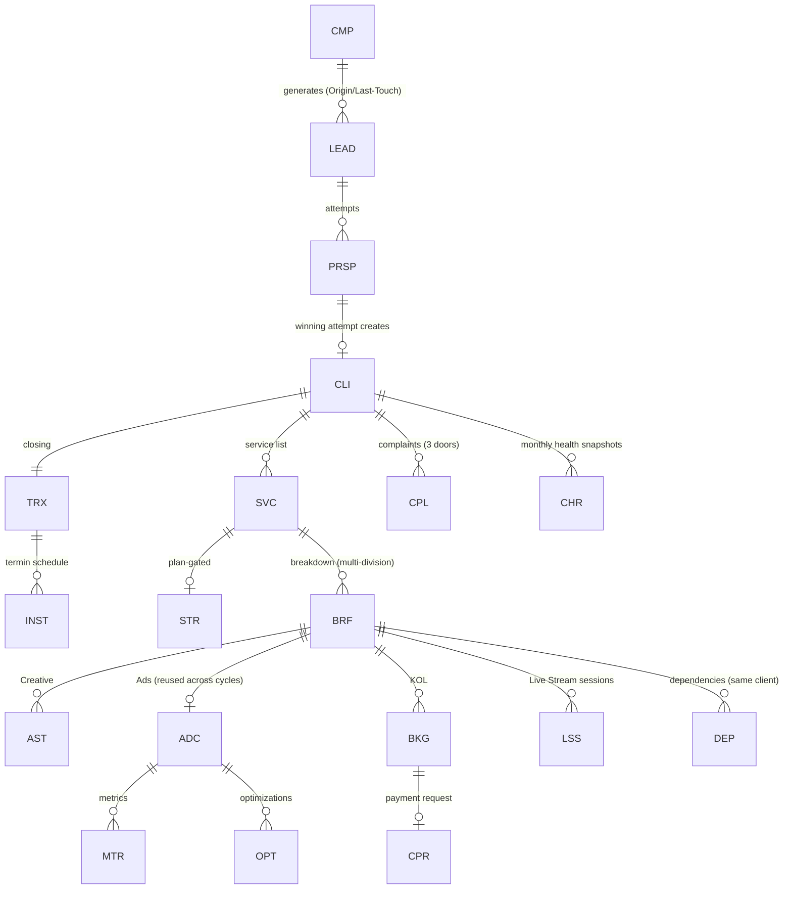

# CDPS — Data Model Reference (consolidated from Phase 0 §3.1 as-built registry + Modules 0–15)

> Source of truth remains the PRD files. This is a navigation/implementation aid: every entity, its prefix, parent, owner module, and creation trigger. If anything here conflicts with a PRD file, the PRD wins — flag it in `docs/DECISIONS.md`.

## 1. Entity registry (as-built)

| Entity | Prefix | Parent | Owner module | Created when |
|---|---|---|---|---|
| Lead record (central registry) | `LEAD-` | — | M1 | First valid intake (Marketing import or Sales registration) |
| Prospect attempt | `PRSP-` | LEAD | M0/M1 | Sales registration or Pool claim; multiple attempts per LEAD allowed for Pool leads |
| Prospect activity (log effort) | `ACT-` | PRSP | M0/M1 | Sales mencatat aktivitas (Follow Up / Jadwal Meeting / Online Meeting / Visit / Lainnya) pada prospek ber-status `Qualified` s.d. state negosiasi terakhir. Banyak per PRSP; append-only (trigger menolak UPDATE/DELETE); ringkasan hasil wajib. **Deviasi PRD** — keputusan pemilik 2026-08-06, lihat `DECISIONS.md` |
| Lead delete request | `LDR-` | LEAD | M1 | Sales mengajukan hapus (alasan wajib); ACC Head memindahkan lead ke `[Deleted]`. **Deviasi PRD** — keputusan pemilik 2026-07-29, lihat `DECISIONS.md`. Satu pending per LEAD (`uq_ldr_one_pending`) |
| Campaign (acquisition) | `CMP-` | — | M3 | Marketing creates; 1:1 with Marketing Performance Record (M2) |
| Marketing Performance Record | (lives on CMP) | CMP 1:1 | M2 | With campaign; holds budget + auto metrics |
| Client | `CLI-` | — | M0→M4 | At `Closed-Success` (winning attempt) |
| Transaction | `TRX-` | CLI | M0→M5 | At closing |
| Installment | `INST-` | TRX | M5 | Termin scheme: schedule set at intent time |
| Service | `SVC-`* | CLI | M0→M6 | At closing, one per service line; upsell = new Service; errors via Void Service (M4-OA-5) |
| Strategy & Plan | `STR-` | SVC | M6 | Plan-gated services, before Brief creation |
| Plan-gate determination | (lives on SVC, PK `service_id`) | SVC 1:1 | M6C | Tier katalog `ditentukan_am`: AM menjawab form G-B sebelum Brief pertama. Menyimpan pemicu yang menyala + keputusan + arah override (`sesuai`/`tolak_plan`/`tambah_plan`) |
| Strategi (Full Store Management) | `STRG-` | SVC | M6A | Dibuat AM untuk Service plan-gated. **Satu versi = satu BARIS** (Rule 13): `versi_no` + `strategi_induk_id` + `versi_sebelumnya_id`; index parsial `uq_strategi_aktif_per_service` menjamin satu `Aktif`. Anak: `strategi_channel` → `strategi_baseline_bulan` (baris per `(channel, month_index)`, D11), `strategi_target`, `strategi_assumption`, `strategi_pillar`, `strategi_resource`, `strategi_risk`, `strategi_version` (append-only). **Field Section A/C/G/I menyusul A-05…A-09.** Diikat ke `SVC` karena CDPS tidak punya entitas CONTRACT — lihat O57 |
| Plan period | `PLAN-` | STRG (full-mgmt) atau CLI (Plan Satuan) | M6B | **Belum dibangun** — lihat `DECISIONS.md` O56. Periode anniversary-month |
| Vendor | `VND-` | — | M6A | Master record bersama (bukan milik satu klien). Prasyarat E-8/F-4 — live stream adalah mode VENDOR (D15/Rule 18), jadi pilar `live` menunjuk `vendors` lewat FK dan tidak menarik kapasitas divisi internal. Tulis: lead Account/Direksi; baca: semua karyawan (E-8 picker). Status lewat mesin `vendor` |
| Brief | `BRF-` | SVC | M6 | AM breaks a Service down; one Service → many Briefs across divisions |
| Asset (Creative unit of work) | `AST-` | BRF | M7 | Brief breakdown into per-deliverable rows |
| Ad Campaign (client-facing paid media) | `ADC-` | BRF (setup) | M8 | Distinct from M3 `CMP-`; persists across recurring strategy cycles |
| Metric Entry | `MTR-` | ADC | M8 | Periodic (weekly confirmed) manual metric input |
| Optimization Log | `OPT-` | ADC | M8 | Each ongoing optimization action |
| Creator Booking (KOL unit of work) | `BKG-` | BRF | M9 | Per creator secured for a client campaign |
| Creator Payment Request | `CPR-` | BKG | M9→M5 | After QC pass; Finance executes disbursement |
| Live Stream Session | `LSS-` | BRF | M10 | AM requests a vendor session; one Brief → many Sessions |
| Dependency | `DEP-` | BRF↔BRF | M11 | AM/SPV declares cross-Brief dependency (same Client only) |
| Complaint | `CPL-` | CLI | M6 | Any of 3 doors (Sales / AM-WhatsApp / Client Portal) — one entity, `Source` field |
| Client Health Report Snapshot | `CHR-` | CLI | M13 | Monthly batch, immutable |
| Performance Score | `PERF-` | User | M14 | Monthly batch, immutable |
| Master Service List entry | (versioned config) | — | Phase 0 v2 §10 | Sales Head/SPV manages; deals reference the version at closing date |

**Prefix registry (M6A §7).** Sejak 2026-08-06 daftar prefix hidup di DUA tempat yang
dijaga tetap identik: tabel `entity_prefix` (PK ⇒ duplikat mustahil) dan `PREFIXES` di
`packages/core/src/ident.ts`. `packages/db/src/ident.registry.test.ts` memindai setiap
call site pembuat ID dan gagal kalau ada prefix yang tidak terdaftar. Tes itu menemukan
`ACT`/`LDR`/`DEMO` mencetak ID tanpa terdaftar — jangan menambah prefix tanpa
mendaftarkannya di kedua tempat.

*`SVC-` prefix: Service IDs are generated at closing per M0 §6; exact prefix string not spelled in the PRDs — confirm prefix label at ticketing (registry pattern implies `SVC-YYYYMM-NNNN`). Log in DECISIONS.md once fixed.

**"Task" is NOT an entity.** It's a role played by AST / BKG / BRF-as-task (Ads). Module 12 adds computed fields (`turnaround_time`, `revision_turnaround`, `speed_score`, `revision_count`) onto those rows, derived from transition history — never stored as independently mutable values.

## 2. Relationship spine (mermaid)

## 3. Key cross-module fields (frequent bug sources — read carefully)

| Field | Lives on | Rule |
|---|---|---|
| Origin Campaign | LEAD → CLI | Immutable first-touch; client lineage (M3 rollups). Written by **both** intake doors: Marketing import, and Sales single registration via the campaign picker (`GET /marketing/campaigns/selectable` — EVERY status, since a campaign absent from the picker can never be attributed and so reads as a permanent zero). **Mandatory when Source ∈ {Leads - Iklan, Broadcast, Event, Kulwa}** (M1 §9.3) unless the salesperson declares the lead outside any campaign — that declaration lives in the audit log (`outside_campaign`), never as a placeholder id. Registration never changes a campaign's status (unlike the import door). See DECISIONS 2026-08-04 |
| Last-Touch Campaign | LEAD | Non-destructive separate field; marketing-spend credit (M2 Attributed Sales). May legitimately diverge from Origin — by design, not a bug |
| GMV saat ini (baseline) | CLI | 3-month avg, frozen at closing; OD-only exceptional correction |
| Total Sales (current) | CLI | Auto + AM manual entries at lower confidence tier; MEA-managed channels only |
| Sales PIC | CLI | = Primary Salesperson (M0 OD-1) |
| Commission & Payment PIC | CLI | From Closing Form; reminder target (M0 OD-3); reassignable by Sales Lead |
| Sales Allocation | CLI | Read-only snapshot, Σ=100% |
| Data Confidence Tier | LSS GMV, manual Total Sales entries | `Vendor-Reported` vs `Platform-Verified`; full value either way, visible badge |
| SLA Target | per Task (AST/BKG/BRF-as-task) | Set individually at breakdown by Lead/SPV; missing ⇒ Speed Score = N/A, never backfilled |
| Component Weights Used | CHR, PERF | Stored per snapshot (post-redistribution) — weights vary month to month |

## 3a. Master Service List v2 Schema (2026-07-16)

Sumber seed kanonik: `backend/seed/msl_kalkulator.csv` (32 layanan dari sheet "Kalkulator Service Jasa"), validasi di `docs/handoff/MSL_KALKULATOR_VALIDASI.md`. Lihat DECISIONS 2026-07-16 untuk konteks keputusan.

**Master Service Version Fields (tambahan):**

| Field | Type | Rule |
|---|---|---|
| category | string | Kategori layanan (opsional, untuk grouping di admin) |
| unit | string | Satuan harga (mis. "per produk", "per 1K view", "per session (3 jam)", "Paket") |
| min_qty | decimal | Batas minimal kuantitas untuk pricing_mode tertentu |
| pricing_mode | enum | `flat` (qty×harga), `min_floor` (max(qty,min)×harga), `batch_ceiling` (ceil(qty/min)×min×harga), `passthrough` (nominal diinput langsung) |
| apply_ppn | bool | PPN 11% ditambahkan (round half-up) bila true |
| frequency | enum | `Monthly`, `One-time`, `Campaign` |
| price_note | string | Catatan tambahan (mis. komisi khusus, syarat khusus) |
| description | string | Deskripsi layanan |

**Qualified Form Services Fields (tambahan):**

| Field | Type | Rule |
|---|---|---|
| quantity | decimal | Jumlah unit yang dipilih (required untuk pricing calculation) |
| input_amount | decimal | Nominal langsung (hanya jika `pricing_mode=passthrough`; null untuk mode lain) |
| unit | string | Satuan (copy dari MSL version, untuk audit) |
| min_qty | decimal | Batas minimal (copy dari MSL version, untuk audit) |
| pricing_mode | enum | Mode penetapan harga (copy dari MSL version) |
| apply_ppn | bool | Flag PPN (copy dari MSL version) |
| subtotal | decimal | Nilai baris terhitung: `flat`=qty×harga; `min_floor`=max(qty,min)×harga; `batch_ceiling`=ceil(qty/min)×min×harga; `passthrough`=input_amount; +PPN 11% jika `apply_ppn`. **Pinned (immutable), recomputable dari parameter.** Estimasi Nilai M0 = Σ subtotal baris. |

## 4. Computation registry (all read-only, recompute-from-log)

- **M0:** Estimasi Nilai Transaksi, Perhitungan Komisi (from Master Service List version at date), allocation math.
- **M2:** CPL, CPRL, Lead-Quality Rate, ROAS (booked), Collected-ROAS (verified amounts, M5), junk breakdown.
- **M5:** Amount Verified/Outstanding, Transaction rollup (`[Lunas]` only when all INST `[Terverifikasi]`).
- **M12:** turnaround_time (excludes `[Blocked]` intervals; revision rounds do NOT reset), revision_turnaround, speed_score (uncapped), revision_count (≥3 auto-flags Quality review).
- **M13:** 7 sub-scores (capped 0–100), weight redistribution for missing components, Health Score + band; monthly snapshot immutable; live preview never stored.
- **M14:** role KPI Profiles (weights admin-configurable), raw components normalized `Actual÷Target×100` capped 100, Client-Outcome Modifier `clamp((avg−80)÷2, −10, +10)`, final bounded 0–100.
