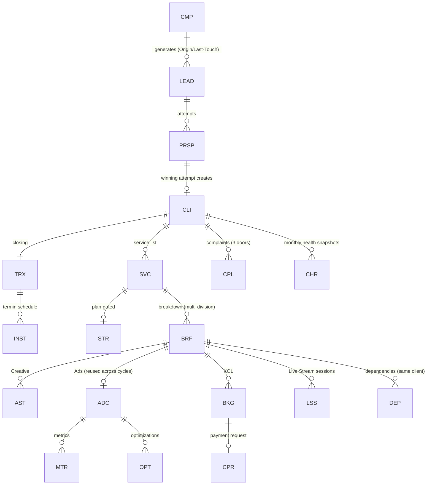

# CDPS — Data Model Reference (consolidated from Phase 0 §3.1 as-built registry + Modules 0–15)

> Source of truth remains the PRD files. This is a navigation/implementation aid: every entity, its prefix, parent, owner module, and creation trigger. If anything here conflicts with a PRD file, the PRD wins — flag it in `docs/DECISIONS.md`.

## 1. Entity registry (as-built)

| Entity | Prefix | Parent | Owner module | Created when |
|---|---|---|---|---|
| Lead record (central registry) | `LEAD-` | — | M1 | First valid intake (Marketing import or Sales registration) |
| Prospect attempt | `PRSP-` | LEAD | M0/M1 | Sales registration or Pool claim; multiple attempts per LEAD allowed for Pool leads |
| Prospect activity (log effort) | `ACT-` | PRSP | M0/M1 | Sales mencatat aktivitas (Follow Up / Jadwal Meeting / Online Meeting / Visit / Lainnya) pada prospek ber-status `Qualified` s.d. state negosiasi terakhir. Banyak per PRSP; append-only (trigger menolak UPDATE/DELETE); ringkasan hasil wajib. **Deviasi PRD** — keputusan pemilik 2026-08-06, lihat `DECISIONS.md` |
| Lead delete request | `LDR-` | LEAD | M1 | Sales mengajukan hapus (alasan wajib); ACC Head memindahkan lead ke `[Deleted]`. **Deviasi PRD** — keputusan pemilik 2026-07-29, lihat `DECISIONS.md`. Satu pending per LEAD (`uq_ldr_one_pending`) |
| Campaign (acquisition) | `CMP-` | — | M3 | Marketing creates; 1:1 with Marketing Performance Record (M2) |
| Marketing Performance Record | (lives on CMP) | CMP 1:1 | M2 | With campaign; holds budget + auto metrics |
| Client | `CLI-` | — | M0→M4 | At `Closed-Success` (winning attempt) |
| Transaction | `TRX-` | CLI | M0→M5 | At closing |
| Installment | `INST-` | TRX | M5 | Termin scheme: schedule set at intent time |
| Transaction change request | `TCR-` | TRX | M5 | SPV/Head Finance mengajukan perubahan skema/jadwal (alasan wajib); **ACC Direktur** yang menerapkannya. **Revisi aturan M5-OA-6 → M5-OA-7** — keputusan pemilik 2026-08-04, lihat `DECISIONS.md`. Satu pending per TRX (`uq_tcr_one_pending`); jadwal pengganti Σ = Amount Outstanding, termin terverifikasi tidak disentuh |
| Service | `SVC-`* | CLI | M0→M6 | At closing, one per service line; upsell = new Service; errors via Void Service (M4-OA-5) |
| Strategy & Plan | `STR-` | SVC | M6 | Plan-gated services, before Brief creation |
| Plan-gate determination | (lives on SVC, PK `service_id`) | SVC 1:1 | M6C | Tier katalog `ditentukan_am`: AM menjawab form G-B sebelum Brief pertama. Menyimpan pemicu yang menyala + keputusan + arah override (`sesuai`/`tolak_plan`/`tambah_plan`) |
| Contract (kesepakatan klien) | `CTR-` | CLI | M6A/M6B | **O57, keputusan pemilik 2026-08-07.** Satu kesepakatan yang memayungi n Service milik SATU klien — klien yang membeli Store Management + GMV Max + Nano KOL dalam satu kesepakatan 12 bulan mendapat SATU Strategi, bukan tiga. Memegang **jendela kontrak** (`durasi_bulan`, `tanggal_mulai`, `tanggal_akhir`) sebagai satu-satunya sumber: kolom senama di `strategi` DIHAPUS migrasi 20260807120000, supaya generator periode M6B (§7 "n periode = n bulan kontrak") tidak punya dua angka untuk dipilih. `services.contract_id` nullable — Service tanpa kesepakatan payung tetap sah. Konsistensi klien dijaga FK KOMPOSIT `(contract_id, client_id)` ke `contracts (id, client_id)`, bukan trigger. **Tanpa mesin status**: tidak ada PRD yang memberi kontrak siklus hidup, dan mendaftarkan mesin kosong berarti mengarang nama state (aturan rumah #2). Uang TIDAK di sini — nilai sepakat & termin tetap `TRX`/`INST`. **R-01 (Kinerja Sales, migrasi `20260901040000`):** kolom `jenis` (`baru`\|`perpanjangan`\|`cross_sell`, default `baru`, CHECK) + `contract_sebelumnya_id` nullable (FK self, rantai perpanjangan) — klasifikasi dicatat SEKALI di titik pembuatan kontrak, dibaca `salesperf.ts` untuk kolom Baru/Perpanjangan/Cross Sell dashboard Kinerja Sales. Semua kontrak eksisting di-backfill `baru`. Pintu PENULISAN renewal (Sales boleh membuat `CTR-` kedua dari Client Record) BELUM dibangun — garis stop R-03/R-04, lihat `DECISIONS.md` Kinerja Sales #4 |
| Strategi (Full Store Management) | `STRG-` | CTR | M6A | Dibuat AM untuk Service plan-gated. **Satu versi = satu BARIS** (Rule 13): `versi_no` + `strategi_induk_id` + `versi_sebelumnya_id`; index parsial `uq_strategi_aktif_per_contract` menjamin satu `Aktif` **per KONTRAK** (O57). Anak: `strategi_channel` → `strategi_baseline_bulan` (baris per `(channel, month_index)`, D11), `strategi_target`, `strategi_assumption`, `strategi_pillar`, `strategi_resource`, `strategi_risk`, `strategi_version` (append-only), `strategi_akses` (A-15 matriks channel × akses × status; A-16 blocker = flag `memblokir` + `target_tanggal_beres` pada baris yang SAMA, bukan tabel kedua). **Section A (A-05) adalah 20 kolom di `strategi` sendiri** — diisi sekali per Strategi, bukan per channel (§4); **Section B grup B-2…B-9 (A-06) adalah kolom di `strategi_channel`** (satu angka per channel; yang per bulan tetap baris di `strategi_baseline_bulan`). Kolom Section A/B NULLable dan kelengkapannya ditegakkan gerbang submit, karena §7 meminta autosave 20 detik dan §5 langkah 5 meminta hitungan hidup field yang belum terisi. **Section C (A-07) = empat tabel anak** (`strategi_diagnosa`, `strategi_quick_win`, `strategi_risiko_struktural`, `strategi_prasyarat_klien`) — semuanya daftar berulang. **Section D (A-08) menambah NOL tabel:** D-1/D-2/D-4 sudah di `strategi_target` dan D-8/D-9 di `strategi_assumption` sejak A-03; yang baru adalah tiga kolom `definisi_berhasil_30/60/90` (D-5 — kardinalitasnya TETAP tiga, jadi kolom, bukan tabel anak), satu array jsonb `leading_indicator` (D-6 — `ck_strategi_leading_indicator` menegakkan bentuk array + cap 5 + keanggotaan set tertutup lewat `<@`, set-nya = kosakata metrik D-4; pertanyaan terbuka X-13), dan lima kolom `sanggahan_*` (D-7 — **HARD-INTERNAL §4.1**, advisory, dan tidak bisa menurunkan floor karena jalur tulisnya tidak menyentuh `strategi_target`). **D-3 TIDAK punya kolom sama sekali** — turunan dari D-2 (X-11). `strategi_assumption.status` di-flip lewat endpoint tersendiri yang sengaja bisa dijangkau saat `Aktif` (asumsi gugur saat eksekusi), dan flip ke `Gugur` mengemisikan `strategi_revisi_disarankan`. **Section E/H narasi (A-09a) = empat kolom header** (`growth_thesis` E-1 · `urutan_eksekusi_alasan` E-13 · `skenario_mundur` H-3 · `kondisi_stop_scope` H-4 — H-4 **HARD-INTERNAL §4.1**). **Section E/G/H/I sisanya (A-09b) = lima tabel anak + enam kolom:** `strategi_ketergantungan_klien` (E-12 — item/kapan/konsekuensi; **sengaja BUKAN digabung dengan C-7 `strategi_prasyarat_klien`**: C-7 gerbang sebelum eksekusi dan tak punya konsekuensi, E-12 ketergantungan berjalan yang seluruh gunanya ada di `konsekuensi`), `strategi_fase` (G-1, min 2), `strategi_tanggal_besar` (G-2 — dibaca M6B Rule 7 untuk re-weight distribusi mingguan), `strategi_trigger_revisi` (H-2 — tujuh kode ditranskripsi dari §4, `ambang` wajib untuk `pencapaian_di_bawah_target`/`stok_kosong` dan wajib NULL untuk sisanya; `uq_strtrg_kode` parsial supaya `lainnya` boleh berulang), dan `strategi_dispatch` (**I-2 + I-4 satu tabel** — keduanya ber-key divisi, jadi catatan I-4 adalah kolom di baris penerima Brief, bukan tabel kedua; set divisi identik `briefs.assigned_division`). Kolom: `review_klien_frekuensi`/`_format`/`_pic` (G-3) + `review_internal_frekuensi` (G-4) — **teks bebas karena §4 menandai G-3/G-4 `Struct`, bukan Enum**, dan PRD tidak pernah menulis daftar frekuensi; `metrik_laporan_klien` jsonb (I-3, set tertutup = kosakata D-4, pertanyaan terbuka **X-14**); dan `prioritas`/`prioritas_alasan` di **`strategi_channel`** (E-2 — di baris channel, bukan tabel anak, karena `saveChannels` DELETE-then-INSERT). **H-2 juga menutup J-3:** `strategi_version.trigger_revisi` menerima string apa pun sejak A-03 karena daftar Rule 13 belum ada; `ck_strver_trigger_set` sekarang mengikatnya ke set H-2 yang sama, dan subset per-Strategi (J-3 ⊆ H-2 record ini) ditegakkan domain karena CHECK tidak boleh ber-subquery. **I-1 dan J-4 TIDAK punya kolom** — turunan, sekelas D-3/X-11. Diikat ke `CTR`, bukan `SVC` (O57 SELESAI 2026-08-07): jalur Service → Strategi tetap satu hop lewat `services.contract_id`, dan `GET/POST /services/{id}/strategi` tidak berubah. `strategi_target.sumber_floor` mencatat **jalur persetujuan** (`input_am` → `disetujui_head`), bukan asal angka |
| Plan period | `PLAN-` | CTR (full-mgmt) atau CLI (Plan Satuan) | M6B | **Bentuk dibangun B-01** (`20260810000000_m6b_plan.sql`): tabel `plan` + enam anak (`plan_target` PK (plan,channel,metric) dengan `nilai_strategi` immutable · `plan_row` unit kerja P-C, ber-FK ke `strategi_pillar`/`services`, satu asal ditegakkan `ck_plan_row_asal_tunggal` · `plan_row_week` P-D · `plan_actual` hybrid P-E, `sumber` manual/otomatis · `plan_review` 1:1 P-F · `plan_flag` P-G auto). **Satu baris = satu PERIODE** (§8); n periode = durasi kontrak. `lingkup ∈ kontrak/klien` menyatukan Full-Management (ber-`contract_id`+`strategi_id`) dan Plan Satuan (`klien`, keduanya NULL), dipasangkan `ck_plan_lingkup_shape`. Mesin **#16** (`Terjadwal`→`Draft`→`Aktif` LANGSUNG, AM tanpa persetujuan SPV sejak 2026-08-28, DEVIASI PRD `docs/DECISIONS.md` — edge `Diajukan` lama masih ada tapi vestigial; auto 2..n via `Terjadwal`→`Aktif`). GENERASI periode (B-02), gerbang transisi (B-03), penyesuaian target (B-04), distribusi mingguan (B-05), realisasi hybrid (B-06 — `20260810020000`) SUDAH mendarat. **B-06:** metrik `otomatis` di `plan_actual` UPDATE-blocked untuk aktor JWT (AM) di **DB + RLS** (invariant beku): trigger `trg_plan_actual_no_manual_auto` (belt, semua koneksi; aktor sistem = tanpa klaim JWT → lolos; hanya `sengketa` boleh berubah di baris otomatis) + RLS `WITH CHECK` (`plan_actual_insert` manual-only, `plan_actual_update` scope via `private.jwt_can_write_plan`). GMV manual lewat `recordManualActual`; auto lewat `recordAutoActual` (sistem). Pasca-tutup TIDAK dikunci (X-07) → amandemen di `audit_log`, nol kolom baru. **Tutup transaksional (B-07) & carry-over eksplisit (B-08 — `20260810030000`) SUDAH mendarat.** **B-08:** kolom `plan_row.keputusan_carryover` (`dibawa`/`dibatalkan`/`revisi`, NULL=belum diputus; disposisi baris ASAL, beda dari `terbawa` yang menandai baris TUJUAN); `decideCarryOver` mencap keputusan + `audit_log` immutable, `dibawa` menyalin baris ke periode berikutnya (`terbawa`+`periode_asal_id`, `kuota` apa adanya — tak ada hitung "sisa"). Komponen `defisit_terbawa` §263 "Σ negative variance chosen to carry" DITUNDA (X-18); deficit tetap = Σ penyesuaian turun (B-04, dihitung). Job (B-09) SUDAH mendarat. **Plan Satuan (B-10 — `20260811000000_m6b_plan_satuan.sql`) SUDAH mendarat:** lihat baris `Plan Satuan (rantai)` di bawah. Periode anniversary-month |
| Plan Satuan (rantai) | — (PK `client_id`) | CLI | M6C §7 | **B-10** — tabel rantai `plan_satuan` (satu per klien, S2): `tanggal_mulai_siklus` (jangkar Rule 7 — untuk Full-Mgmt ada di `strategi`, Plan Satuan tak punya Strategi) + `status_dormansi` (mesin **#17** `Aktif ⇄ Dorman`, STATE_MACHINES §6e). BUKAN kolom di `plan`: dormansi properti RANTAI, bukan satu periode (n salinan = anti-pola). Periode-nya tetap baris `plan` `lingkup='klien'` (mesin #16). Rule 6 (buka/gabung/reaktivasi) = `openOrJoinPlanSatuanTx` dipanggil di `plangate.decideGate` saat `keputusan_am='butuh_plan'`, mengisi `service_plan_gate.plan_id` (FK-nya juga B-10). `plan_flag` jenis `di_luar_service` (analog `di_luar_strategi`, §7.9). Review tutup 4-field (bukan 8) untuk `lingkup='klien'` — tanpa diagnosa/rekomendasi (tak ada Strategi). Nol prefix baru (kunci rantai = client_id). **B-11 (integritas §4b, `20260811010000`):** trigger `trg_spg_service_single_plan` di `service_plan_gate` — saat `plan_id` diisi, Plan yang ditaut wajib `lingkup='klien'` DAN service yang kontraknya punya Strategi (kontrak Full-Management) ditolak masuk Plan Satuan (sudah tercakup Plan `lingkup='kontrak'`); "satu service ⇒ ≤1 Plan" sendiri dipikul PK `service_plan_gate(service_id)`, jadi tak ada index redundan. Cerminan TS beku: `plangate.serviceInFullMgmtContract` + `MSG_FULL_MGMT_PLAN`. Penanda full-mgmt = Strategi pada kontrak, ber-scope KONTRAK bukan KLIEN |
| Vendor | `VND-` | — | M6A | Master record bersama (bukan milik satu klien). Prasyarat E-8/F-4 — live stream adalah mode VENDOR (D15/Rule 18), jadi pilar `live` menunjuk `vendors` lewat FK dan tidak menarik kapasitas divisi internal. Tulis: lead Account/Direksi; baca: semua karyawan (E-8 picker). Status lewat mesin `vendor` |
| Brief | `BRF-` | SVC | M6 | AM breaks a Service down; one Service → many Briefs across divisions. **Dua asal saling eksklusif (RAB-16/17, migrasi `20260818000000`):** manual STR- (`strategy_id` terisi, `plan_row_id` NULL, `createBrief`) **vs** warisan M6B (`plan_row_id` terisi FK→`plan_row` ON DELETE SET NULL, `strategy_id` NULL, `inheritBriefsFromPlan`). Kolom `briefs.plan_row_id` = **kolom, bukan tabel** ⇒ gate tabel TETAP 118. Index parsial UNIQUE `uq_briefs_plan_row` menjaga satu `plan_row` menurunkan ≤1 Brief (idempoten "satu klik warisi-semua"). Kelahiran Brief tunggal (`insertBrief`) dibagi kedua jalur — Brief warisan & manual lahir identik. **F-4 (Feedback OD 2026-09-07) menambah EMPAT KOLOM, nol tabel** (`20260922100200`): `tanggal_mulai`/`tanggal_akhir` (`date`, jendela campaign — diproyeksikan dari `plan.tanggal_mulai`/`tanggal_akhir` yang sebelumnya tidak pernah sampai ke Brief), `budget` (`numeric(18,2)`, tipe diselaraskan `plan_row.budget` — sebelumnya hanya nyangkut sebagai TEKS di dalam `instructions`, jadi tidak bisa diurutkan/dibandingkan/dipakai memicu pengingat: keluhan KOL #1), dan `source_creative_brief_id` (FK **self-referencing** ke `briefs`, nullable — ketokan K-3: Brief Ads menunjuk Brief Creative sumbernya dan picker aset menyaring ke situ; NULL = tidak ditunjuk, picker jatuh ke seluruh aset `[Approved]` milik klien). Keempatnya nullable ⇒ nol backfill, Brief lama tetap sah. Tiga CHECK menjaganya: `ck_briefs_jendela_urut` (mulai ≤ akhir, NULL satu sisi tetap lolos — jendela yang belum lengkap bukan jendela yang salah), `ck_briefs_budget_non_negatif` (nol boleh), `ck_briefs_sumber_bukan_diri`. FK-nya **tanpa `ON DELETE`** dengan sengaja: `briefs` tidak punya jalur hapus (riwayat immutable, aturan rumah #3), jadi RESTRICT default adalah jawaban yang benar kalau ada yang mencoba. Indeks parsial `idx_briefs_source_creative` ⇒ gate tabel TETAP 146 |
| Interview (Kualifikasi Klien) | `ITV-` | CLI (opsional CTR/SVC) | M6-Interview | AM membuka "Riset & Interview Klien" — SATU sesi = satu ITV. Bentuk ID rumah `ITV-YYYYMM-NNNN` (BUKAN `ITV-YYYY-NNNNN` dari PRD), preseden STRG/PLAN/VND. Klik ulang **melanjutkan** sesi non-terminal yang sama (`openKelolaKlien`), bukan membuat baris baru |
| Riset Awal (langkah 1 Riset & Interview Klien) | — (PK `interview_id`) | ITV 1:1 | M6-Interview | **QA pemilik 2026-08-12.** Lahir bersama ITV di transaksi yang sama: membuka Riset & Interview Klien = mulai riset awal (AM login toko klien & catat data baseline). Mesin **#20** `riset_awal` (`Berjalan → Selesai`, STATE_MACHINES §6f). **Nol prefix baru** — kunci alami `interview_id`, preseden `plan_satuan`. Jangkar `dimulai_pada`/`disubmit_pada` dibekukan trigger; **durasi TIDAK disimpan**, diturunkan saat baca oleh `durasiRisetAwalMenit` (aturan rumah #4). **Isian baseline SUDAH dibangun (RAB-01, Wave A, migrasi `20260817…`) — empat tabel anak** (semua `bigint GENERATED ALWAYS AS IDENTITY`, pola `client_platforms`, jadi registry prefix tak berubah — nol prefix baru): **(1) `riset_awal_analisa`** — satu baris per (riset awal × platform aktif), di-anchor `client_platforms`: `metode_baseline` (`analisa_penuh`/`analisa_tipis`/`manual`), `periode_referensi`, `payload jsonb` **immutable** (trigger, aturan rumah #3), `kondisi_toko` (CHECK 5 nilai — **Skor Kondisi Toko**, kesehatan toko, label TANTANGAN; DISJOINT dari verdict Blok C), `skor`, `benchmark_versi`/`parser_versi`, `cakupan_riwayat`, `kelengkapan_file jsonb`; CHECK `metode_baseline='manual'` ⇒ `kondisi_toko='belum_dapat_diukur'` DAN `skor IS NULL`. **(2) `riset_awal_sumber_berkas`** — `nama_berkas`/`sha256`/`ukuran_bytes`/`tipe_terdeteksi`/`tipe_override`/`jumlah_baris`/`periode`/`tanggal_ambil` — inilah yang mengisi `sumber_data` + `lampiran` M6A secara sah (memenuhi Rule 5, RAB-19). **(3) `interview_riset_awal_isian`** — pola `interview_answer`, baris per field bertipe + `sumber` (`analisa`/`manual`/`sales`) + `nilai_usulan jsonb` immutable (usulan asli) + `dikonfirmasi` (usulan→konfirmasi per angka). **(4) `riset_awal_benchmark`** — berversi, Director-only. Baseline mengalir ke Strategi Section B lewat `getBaselinePrefill` (RAB-11). **B2 (2026-09-06):** `metode_baseline='analisa_penuh'` kini melayani DUA mesin — TikTok Shop (`cdps.baseline.tiktok.v1`, ambang `riset_awal_benchmark`) dan **Shopee** (`cdps.baseline.shopee.v1`, ambang `report_benchmark_shopee`). Karena ambangnya tinggal di dua tabel berbeda, migrasi 183 menambah kolom **`benchmark_versi_shopee`** + CHECK `ck_analisa_benchmark_xor` (tepat SATU kolom benchmark terisi) — pola cermin SH-01 di `client_reports`. `parser_versi` membedakan keduanya (`cdps-baseline-v1` vs `cdps-baseline-shopee-v1`). Skor Shopee dinaikkan ×10 dari skala mesin 0–10 ke skala kolom 0–100 sekali di `buildShopeeBaselinePayload`; `payload.skor.total_mesin` menyimpan angka aslinya |
| Hari libur nasional | — (PK `tanggal`) | — | Admin | **Keputusan pemilik 2026-08-13.** `hari_libur` — kalender yang dibuang dari hitungan **hari kerja** (`working_days_between`, SATU helper untuk seluruh sistem, STABLE karena membaca tabel ini). Diisi Direksi lewat `/admin/hari-libur` (OD baca). **Mulai KOSONG** — tanggal SKB berubah tiap tahun, menanamnya di migrasi = mengarang fakta bisnis. Kosong ⇒ hanya Sabtu/Minggu yang dibuang |
| SLA timeline Riset & Interview Klien (config) | — (PK `version`) | — | M6-Interview | **Keputusan pemilik 2026-08-13.** `kelola_klien_sla_config` — ambang **berversi** tiga langkah (v1: Riset Awal 2–3, Interview Meeting 1–2, Brand Strategy 5–7 hari kerja), pola `kualifikasi_config`. Menggeser angka = baris versi baru, bukan deploy. Jangkarnya: langkah 1 di `interview_riset_awal`, langkah 2/3 di `interview.meeting_diamankan_pada` / `selesai_pada` (di-stamp trigger, beku), akhir langkah 3 di `strategi.diajukan_pada` / `strategy_plans.diajukan_pada`. Pelanggaran ⇒ `interview_flag` (`sla_riset_awal_terlambat` / `sla_meeting_terlambat` / `sla_strategi_terlambat`) dari `interview_daily_tick`; **nol event notifikasi baru** |
| Asset (Creative unit of work) | `AST-` | BRF | M7 | Brief breakdown into per-deliverable rows |
| Ad Campaign (client-facing paid media) | `ADC-` | BRF (setup) | M8 | Distinct from M3 `CMP-`; persists across recurring strategy cycles |
| Metric Entry | `MTR-` | ADC | M8 | Periodic (weekly confirmed) manual metric input |
| Optimization Log | `OPT-` | ADC | M8 | Each ongoing optimization action |
| Laporan Mingguan Ads | — (PK `brief_id, iso_year, iso_week`) | BRF | M8 | **Follow-up PR #172, keputusan pemilik 2026-08-19.** `ads_weekly_reports` — laporan Advertiser (PIC) per brief per minggu ISO (batas WIB Sen–Min, kunci ISO disimpan eksplisit seperti `WRR`): `analisa` performa + `saran` perbaikan (keduanya wajib) + `kendala` opsional. **NOL angka disimpan** — realisasi mingguan (spend/GMV/ROAS/view/CTR/CVR) diturunkan saat baca dari `metric_entries` kampanye brief itu, definisi rasio identik agregat M6D. **Realisasi-saja**: target per-brief hidup di `strategy_plans`/`m6_strategy_kpi_tasks` (2026-08-12), tidak di sini. **Append-only** (`forbid_mutation` UPDATE+DELETE; koreksi = laporan minggu berikutnya). Bukan duplikat M6D RM-D6 (`wrr_catatan_divisi`): itu per KLIEN oleh LEAD ke rekap AM, ini per BRIEF oleh Advertiser — bahan mentahnya. Minggu selesai tanpa laporan ditandai `terlambat` saat baca; nol event notifikasi baru. Migrasi `20260819020000_m8_laporan_mingguan_advertiser.sql` |
| Creator Booking (KOL unit of work) | `BKG-` | BRF | M9 | Per creator secured for a client campaign |
| Creator Payment Request | `CPR-` | BKG | M9→M5 | After QC pass; Finance executes disbursement |
| Live Stream Session | `LSS-` | BRF | M10 | AM requests a vendor session; one Brief → many Sessions. **LT-61 (2026-09-03):** `vendor_id` FK (nullable, stamped once at creation from the client's Aktif Strategi `live` pillar, never updated) lets the assigned vendor self-serve `confirmByVendor`/`logResults` via a second, non-HRIS auth realm (`vendor_accounts`, one row per Supabase Auth user → `vendors.id`) — additive to the AM/Director path; reconciliation stays AM/Director-only. Spec: `docs/prd/CDPS_Module10_Addendum_LT61_Vendor_Portal_Spec.md` |
| Dependency | `DEP-` | BRF↔BRF | M11 | AM/SPV declares cross-Brief dependency (same Client only) |
| Complaint | `CPL-` | CLI | M6 | Any of 3 doors (Sales / AM-WhatsApp / Client Portal) — one entity, `Source` field. **Pintu #3 DIBANGUN 2026-09-08**: kolom `submitting_contact_id` (FK `client_contacts`) + CHECK `source='Client Portal' ⇒ kontak wajib` (spec §5.1 mencatat aksi per KONTAK, bukan per klien — tanpa itu komplain jadi anonim), rate limit `check_complaint_rate_limit` 5/kontak/jam + 20/IP/jam. Ketiga pintu memakai `account.insertComplaint` yang SAMA ⇒ satu aturan komplain, satu jalur notifikasi (`m6.complaint.logged`, nol event baru). **Submit-only** (M15 Rule 6): nol endpoint baca, juga tidak sebagai stub |
| Rekap Hasil Mingguan | `WRR-` | CLI | M6D | **Owner request 2026-08-12** (`DECISIONS.md`). Auto-generated satu per klien aktif per minggu ISO (Senin 00:00 WIB, mesin **#18**, STATE_MACHINES §15). Aggregation-and-narrative layer — **tidak memiliki data eksekusi**: RM-B/RM-C dibaca dari M7/M8/M9/M10 + M6B, baris `otomatis` UPDATE-blocked (invariant beku, bentuk sama `plan_actual`). Anak: `WRR_DIVISI` (produksi per divisi — # video/# creator/# live), `WRR_METRIK` (view/GMV/CTR/CVR/ROAS, `sumber ∈ otomatis/manual/tidak_tersedia`), `WRR_CATATAN` (+ `WRR_CATATAN_DIVISI` append-only). N:1 `PLAN` nullable (null = klien `Tanpa Plan`). Index parsial `(client_id, iso_year, iso_week)`. **GMV interim only** — GMV resmi tetap M6B P-E (single-source). Rollup ke PE-3/PE-8 di penutupan periode. **Dibaca halaman Client Health sebagai blok ringkasan H-1/H-2** (M6D §8 + amandemen M13 §8) — view-only, skor M13 (7 komponen + bobot) TIDAK berubah; `CHR-` tak pernah ditulisi ulang. Register `WRR` di `entity_prefix` + `PREFIXES` |
| Client Milestone (Upcoming Milestones) | `MLS-` | CLI | M6D / RM-11 | **T-4c, keputusan pemilik 2026-08-14 "milestone terstruktur".** Satu tonggak per baris (judul + `target_date` + status), menggantikan catatan teks bebas RM-C9 untuk milestones. Mesin **`client_milestone`** (`[Upcoming]`→`[Done]`\|`[Cancelled]`, STATE_MACHINES §16); status hanya via `sm_transition`, riwayat immutable `audit_log`. Baca via service-role + gate TS (`milestone.canView`: AM pemilik / Account lead / OD / Director), RLS `client_milestones_select` (cermin `client_health_snapshots`). Ditampilkan halaman klien (kelola) + blok read-only di rekap mingguan. Register `MLS` di `entity_prefix` + `PREFIXES`. Migrasi `20260814070000_t4c_milestones.sql`. **Penjelasan untuk AM: [`docs/FITUR_UPCOMING_MILESTONE.md`](FITUR_UPCOMING_MILESTONE.md)** |
| Penugasan Internal | `TSK-` | — (User) | Penugasan (di luar 18 PRD) | **Permintaan pemilik 2026-08-14** (`DECISIONS.md`). Tugas yang atasan berikan ke anggota timnya, **tanpa induk klien** — satu-satunya entitas kerja di CDPS yang tidak menempel pada rantai Klien→Service→Brief. **BUKAN Task M12:** PRD M12 §2 Rule 1 membekukan Task = `AST-` \| `BKG-` \| `BRF-`-as-task, ketiganya wajib turunan klien berbayar; modul ini entitas kedua yang berdiri sendiri dan `task.ts` (M12) tidak disentuh. Mesin **#21 `internal_task`** (`[Ditugaskan]`→`[Dikerjakan]`→`[Selesai]` \| →`[Dibatalkan]`, STATE_MACHINES §17). Kolom: `judul`, `deskripsi`, `assignee_id`+`assignee_division` (**dibekukan** di baris — karyawan pindah divisi tidak memindahkan catatan performanya), `due_date` (**beku**), `lampiran_link` (rujukan pemberi tugas, cermin `Brief.reference_attachments`), `link_hasil` (hasil kerja PIC, **wajib** saat `[Selesai]`, cermin `Asset.output_link`), jangkar beku `dimulai_pada`/`selesai_pada`/`dibatalkan_pada`. **NOL kolom keterlambatan** — `terlambat_berjalan`/`selesai_terlambat`/`hari_terlambat` diturunkan saat baca dari `due_date`+`selesai_pada`+`status` dalam kalender WIB (aturan rumah #4), sehingga "pernah terlambat" permanen tanpa flag yang bisa ditulis ulang. Gate: Director ke siapa saja (termasuk lead), Lead/SPV ke staff divisinya; OD read-only. RLS `internal_tasks_select` (read-all \| lead sedivisi \| PIC \| pemberi tugas) **+ `GRANT SELECT TO authenticated`** — tanpa GRANT, `readAsActor` ditolak sebelum policy dievaluasi. Rekap disiplin = **laporan terpisah, NOL bobot M14** (bobot RM-9a baru ditandatangani 2026-08-13). Notifikasi: **v9** `penugasan_ditugaskan` (→PIC) / `penugasan_selesai` (→pemberi tugas); **v10** `penugasan_mendekati_jatuh_tempo` (H-1, →PIC saja) / `penugasan_jatuh_tempo` (→PIC + pemberi tugas + lead divisi) / `penugasan_dibatalkan` (→PIC). Dua event jatuh tempo diemit job harian `penugasan_reminder_tick` (pg_cron 07:00 WIB + route `POST /api/v1/internal/penugasan/tick`), **sekali saja** lewat penanda searah `pengingat_h1_terkirim`/`jatuh_tempo_terkirim`. Register `TSK` di `entity_prefix` + `PREFIXES`. Migrasi `20260814110000_penugasan_internal.sql` + `20260814120000_penugasan_notif_jatuh_tempo.sql` |
| Divisi (registry) | — (PK `code`) | — | M16 | **Permintaan pemilik 2026-08-28.** `division_registry(code, nama, aktif, brief_assignable, dispatch_target, vendor_managed, urutan)` — menggantikan daftar divisi yang ter-hardcode di ~8 tempat (`strategi.ts:250` `DISPATCH_DIVISIONS`, `account.ts:376`/`:386`, `recap.ts:189`, `plan.ts:2051`, `board.ts:719`, `performance.ts:43-50`, `web-internal/src/lib/{penugasan,tasks}.ts`). **Dual-home** seperti registry prefix: tabel + konstanta TS `packages/core/src/division.ts`, dijaga registry test (pola `ident.registry.test.ts`) supaya tipe TS tetap sempit sekaligus penambahan divisi cukup 1 migrasi + 1 baris konstanta. **`nama` memakai label lama apa adanya** (`'Live Stream'`, bukan `'LIVE'`) ⇒ **NOL migrasi data** pada `briefs.assigned_division`, `role_mappings.division`, `wrr_divisi.divisi` yang semuanya menyimpan string label. Seed: 6 divisi existing + **AI Optimizer** (M17) + **Store Operation** (pipeline kosong, daftar pekerjaan menyusul — `DECISIONS.md` LT-2). **Nol prefix baru** |
| Pipeline tahapan + definisinya | — (PK `code` / `pipeline_code,stage_code`) | division_registry | M16 | `stage_pipeline(code, division_code, deliverable_type, machine_name, aktif)` + `stage_definition(pipeline_code, stage_code, label, urutan, sumber, status_dipetakan, gate_pihak, target_hari_kerja)`. Lapisan tahapan produksi per Brief (STATE_MACHINES §18). **`sumber`** menentukan asal checkpoint: `'stage'` = punya state sendiri di mesin tahapan; **`'status_brief'` = TIDAK menyimpan apa pun**, `status_dipetakan` menunjuk status Brief yang sudah ada dan durasinya diturunkan dari log status itu — dipakai untuk `QC Account Service`=`[In Review]` dan `Revisi`=`[Revision Requested]`, sehingga nol duplikasi dan `turnaroundHours` lama tetap sah. `gate_pihak` ∈ {NULL, `'AM'`, `'KLIEN'`}; tahap ber-gate `KLIEN` dikeluarkan dari lead time divisi seperti interval `[Blocked]`. **Nol prefix baru** |
| Tahapan aktif sebuah Brief | (kolom pada `briefs`) | BRF | M16 | `briefs.production_stage` + `briefs.stage_pipeline_code`. Ditulis **hanya** lewat `sm_transition` dengan `p_entity_type='brief_stage'` — **BUKAN `'brief'`**: `computeMetrics` (M12) memfilter `audit_log` dengan `entity_type='brief'` + `action like 'transition:%'`, jadi menulis tahapan sebagai `'brief'` akan mencemari turnaround/Speed Score/revision count SETIAP Brief. `audit_log.entity_type` adalah `varchar(64)` tanpa constraint sehingga namespace terpisah gratis, dan `loadTransitions` dipakai apa adanya dengan argumen `'brief_stage'`. Mesin tahapan **tidak pernah menulis kolom `status`** (aturan rumah #2); satu-satunya kaitan = guard satu arah di `task.submitTask` |
| Override target tahap per Brief | — (PK `brief_id,stage_code`) | BRF | M16 | `brief_stage_sla(brief_id, stage_code, target_hari_kerja, set_by)`. Default ada di `stage_definition.target_hari_kerja`; override ini gerbangnya `isLead(division)`, pola `setSlaTarget` M12. Tanpa target ⇒ `N/A`, tidak pernah di-default diam-diam maupun di-backfill dari Brief. **Satuan HARI KERJA** lewat `working_days_between` (Sen–Jum minus `hari_libur`) — bukan jam, bukan hari kalendar. **Nol prefix baru** |
| Keputusan Cek Brief AM | — (PK `brief_id`) | BRF | M16 | `brief_review(brief_id, keputusan, alasan_kode, catatan, actor_employee_id)`. Gerbang intake wajib semua divisi: *Terima & proses* atau *Brief Dikembalikan ke AM* + alasan terstruktur (Creative: brief kurang jelas / sampel belum diterima / talent tidak tersedia / properti tidak tersedia / lokasi butuh approval — KOL: brief kurang jelas / data tidak lengkap). Inilah rentang yang menjawab "lead time dari AM ke team" — sebelumnya dispatch Brief bahkan **tidak punya notifikasi sama sekali**. **Nol prefix baru** |
| Permintaan | `REQ-` | BRF / SVC | M16 §5.5 | **Permintaan terkait klien** dari divisi: `Top-up Saldo` (Ads→Finance, LT-11), `Contract Creator` (KOL→AM pemilik klien, satu-satunya jenis yang dirute ke AM), `Creator Payment Approval` (KOL→Finance, menyambung `CPR-` M9, tidak menggantikannya). Deadline **1 hari kerja** untuk ketiganya. Mesin `[Diajukan]`→`[Diproses]`→`[Selesai]` \| `[Ditolak]` (STATE_MACHINES §19). **BUKAN `TSK-`**: `internal_tasks` sengaja tanpa `client_id`/`service_id` karena melonggarkannya "akan membongkar gerbang pembayaran M4/M5"; **BUKAN Task M12** karena bukan deliverable yang di-review AM. **Nol kolom keterlambatan** — diturunkan saat baca dari `due_date`+`selesai_pada`+`status` (WIB), `due_date` dibekukan trigger (pola `TSK-`). Register `REQ` di `entity_prefix` + `PREFIXES` (**diverifikasi bebas** 2026-08-28) |
| Laporan Klien (performa mingguan/bulanan) | **— (`id` bigint identity)** | CLI × client_platform | C1 (gap audit, `DECISIONS.md` 2026-08-19) | AM mengunggah export Seller Center/Ads Manager → server `readSheet`/`detect`/`runReport` → satu baris `client_reports` per (toko × tipe periode × rentang), `UNIQUE`. `payload` jsonb IMMUTABLE (trigger `client_reports_frozen`, UPDATE apa pun ditolak). **Penulis tunggal `clients.total_sales`** dalam satuan run-rate 30 hari. Anak: `client_report_berkas` (sidik jari sha256 + metadata, BUKAN biner — Supabase Storage belum ada). **Nol prefix rumah**: laporan bukan entitas ber-prefix. **R3 (2026-09-05):** `payload` bertambah kunci `tahap` — lapisan Awareness/Consideration/Conversion (anak tangga funnel + tiga blok metrik + belanja per tahap), seluruhnya PROYEKSI ULANG angka yang sudah ada di payload, nol input manual. `tahap.fokus` di-STEMPEL dari `client_platforms.tahap_fokus` saat laporan dibuat, jadi memindahkan tahap toko bulan depan tidak mengubah arti laporan yang sudah terbit. `ENGINE_VERSI` naik ke `cdps-report-v1.1`; `schema` tetap `cdps.report.tiktok.v1` (aditif). Laporan pra-R3 tidak punya kunci itu dan payload-nya beku — renderer melewati keempat seksinya |
| Revisi insight laporan | **— (`report_id, revisi`)** | client_reports | C1 lanjutan (2026-09-08) | `client_report_insight`, **append-only** (trigger UPDATE+DELETE). Satu baris per revisi TEKS (ringkasan, poin, rekomendasi tinggi/sedang, outlook, indikator). Revisi 0 = snapshot mesin (`sumber='mesin'`, CHECK mengikat `revisi=0 ⇔ mesin`), jadi "kembalikan ke insight mesin" menyalin baris yang ada, bukan menghitung ulang dengan benchmark yang mungkin sudah berganti versi. Angka laporan TIDAK di sini — hanya narasi. **Tanpa `ON DELETE CASCADE`**: tabel menolak DELETE, jadi CASCADE tak mungkin jalan dan mendeklarasikannya hanya menukar pesan galat yang jelas dengan yang membingungkan; konsekuensinya laporan yang punya revisi insight tidak bisa dihapus, dan itu benar. **R3 (2026-09-05):** kolom `tahap_narasi jsonb NOT NULL DEFAULT '[]'` — `[{tahap,judul,teks}]`, satu paragraf per tahap funnel. Ia ada DI SINI dan bukan di `payload` karena ia SARAN: angka tahap tetap turunan payload yang beku. `[]` pada revisi lama bukan tambalan — revisi itu memang lahir sebelum R3. CHECK `jsonb_typeof = 'array'` (alasan sama `ck_cri_bentuk_json`: objek/skalar akan dirender `[object Object]` ke laporan yang dibaca klien) |
| Publikasi laporan ke klien | **— (PK `report_id`)** | client_reports 1:1 | C1 lanjutan (2026-09-08) | `client_report_publikasi`, lahir `[Draf]` bersama laporannya. `status` HANYA lewat `sm_transition` (mesin **#31** `client_report`, STATE_MACHINES §21); `insight_revisi` **MEMAKU** revisi yang dibaca klien — bukan "terbaru menang", supaya menyimpan draf pada laporan yang sudah tayang tidak langsung jadi pengumuman. CHECK: `[Terbit]` ⇒ paku + stamp terbit ada; `[Dicabut]` ⇒ alasan ada. Paku DIPERTAHANKAN saat pencabutan (jejak revisi mana yang sudah dibaca); yang menggerbang keterbacaan adalah `status`. **Nol prefix baru** |
| Izin pemakaian angka klien di materi pitch | **— (`id` bigint identity)** | CLI 1:N | Gelombang C / gerbang C-5 (`DECISIONS.md` 2026-09-07) | `client_pitch_consents`, migrasi `20260916010000`. **Ledger append-only**: satu baris per PERISTIWA (`aksi` = `beri`\|`cabut`), bukan satu baris keadaan per klien. `berlaku_sampai date NULL` (NULL = tanpa batas; izin berhenti berlaku SESUDAH tanggal ini tanpa perlu dicabut), `dokumen_catatan` (rujukan PKS/email/percakapan — teks bebas dengan sengaja: bentuk buktinya berbeda per klien, dan memaksakan satu bentuk berarti AM menulis yang tidak benar supaya lolos), `alasan` (opsional, untuk `cabut`). CHECK `ck_pitch_consent_bentuk` memaksa tiap peristiwa hanya membawa kolom yang berarti untuknya — baris `cabut` ber-`berlaku_sampai` adalah kalimat yang pembaca hilir harus tebak maknanya. **Status hari ini adalah TURUNAN** (baris terakhir per `client_id` yang `aksi='beri'` DAN `berlaku_sampai` belum lewat), tidak pernah disimpan — aturan rumah #4, dan itu yang membuatnya mustahil basi. Trigger `client_pitch_consents_frozen` menolak **UPDATE DAN DELETE** (beda dari `client_reports` yang hanya membekukan UPDATE: di sini modus gagalnya bukan angka yang ditulis ulang melainkan izin yang LENYAP, sehingga izin yang pernah ditindaklanjuti tak bisa dibedakan dari yang tak pernah ada); `immutability_checks.sql` menuntut kedua trigger itu ada. **Gerbang teknis, bukan catatan**: daftar Showcase yang divisi Sales lihat (C-1) HANYA memuat klien yang barisnya `beri` dan masih berlaku. Tulis = AM pemilik · lead Account · Director (lingkup sama persis `report.canWriteReport`); Sales TIDAK, dan Sales juga tidak ada di policy RLS-nya — yang C-1 buka adalah halaman Showcase, bukan daftar izin per klien. **Nol prefix rumah** (anak `clients`, PK identity, tak pernah disebut manusia lewat ID-nya — pola `client_reports`) |
| Bulan buku (kunci tutup buku) | **— (PK `periode` date)** | — | D-3 / Gelombang D (2026-09-08) | `book_periods`, satu baris per BULAN (hari pertama, WIB). **Kunci alami, bukan ID rumah**: "Agustus 2026" hanya ada satu selamanya, jadi kunci ini membuat duplikat MUSTAHIL alih-alih sekadar "tidak seharusnya terjadi" (preseden `client_reports.id`). `status` HANYA lewat `sm_transition` (mesin **#32** `book_period`, STATE_MACHINES §22) dengan **dua gerbang berbeda**: menutup = Finance lead ATAU Director, membuka kembali = **Director SAJA**. `versi_terakhir` menunjuk versi angka beku terakhir, naik saat ditutup dan **tidak pernah turun** saat dibuka. Jejak buka-ulang TERAKHIR ada di `dibuka_pada`/`dibuka_oleh`/`alasan_buka` (CHECK: lengkap atau tidak ada sama sekali); riwayat LENGKAPnya di `audit_log` `action='buka_ulang_tutup_buku'`. Syarat transisi yang CHECK tak bisa nyatakan ditegakkan trigger `trg_bp_jaga_transisi`. **Nol prefix baru** |
| Angka beku bulan buku | **— (`periode, versi`)** | book_periods | D-3 / Gelombang D (2026-09-08) | `book_period_snapshots`, **IMMUTABLE** (trigger tolak UPDATE **dan** DELETE, pola `audit_log`). Satu baris per PENUTUPAN — buka-ulang tidak menghapus versi lama, tutup-ulang menambah versi baru, jadi "berapa angkanya waktu ditutup pertama kali" tetap bisa dijawab selamanya dan selisih antar versi bisa ditampilkan. `penghitung` mencatat nama+versi mesin yang menghasilkannya (`cdps.accrual.v1`) — tanpa itu, beda antara angka beku dan hitung ulang tidak bisa dijelaskan ("datanya berubah" vs "rumusnya berubah" terlihat sama). `angka` jsonb membawa total, baris per layanan, DAN `tidak_terhitung` (layanan yang tak bisa dihitung + sebabnya) — CHECK menolak `{}`/null/array, karena "bulan ini nol" dan "penghitungnya gagal" tidak boleh berbagi satu bentuk. **Nol prefix baru** |
| Client Health Report Snapshot | `CHR-` | CLI | M13 | Monthly batch, immutable |
| Performance Score | `PERF-` | User | M14 | Monthly batch, immutable |
| Client Portal contact account | (`auth_user_id` PK — no house prefix, mirrors `vendor_accounts`) | CLI | M15-C2 | AM/Account lead/Director invites a named contact for a Client (spec §3.2). **THIRD non-HRIS Supabase Auth realm** (after employee-local and LT-61 vendor), `client_contacts` — one row per Supabase Auth user, multi-contact per Client confirmed (M15 Rule 1; unlike vendor's one-account-per-vendor, this table is deliberately multi-row per Client). Own force-change gate (`must_change_password`, spec §3.6 — vendor never had one) + dual password-reset path (admin-set always available, self-service email new to CDPS, spec §3.3). Migrations `20260905010000`/`20260905020000`. Spec: `docs/M15C2_CLIENT_PORTAL_SECURITY_SPEC.md` |
| Master Service List entry | (versioned config) | — | Phase 0 v2 §10 | Sales Head/SPV manages; deals reference the version at closing date |
| Sales OKR (target) | — (PK `salesperson_id, period_start, period_kind`) | — | M0 §7.1 | **Kinerja Sales S-02, migrasi `20260901020000`.** `sales_targets` — target omzet per salesperson per periode (`period_kind ∈ bulan\|tahun`). Config revisi (bukan riwayat immutable, sama pola `perf_period_targets`); tulis lewat `salesperf.setTarget` (OD/Director saja). **Nol prefix baru** — kunci alami. RLS mencerminkan `salesperf.scopeFor` persis (staff = baris sendiri, lead/SPV Sales = se-divisi, OD/Director = semua); **`GRANT SELECT TO authenticated` wajib** (tabel lahir setelah RLS baseline — jebakan yang sama seperti #44 di bawah). Sengaja BUKAN `perf_period_targets` — lihat `DECISIONS.md` Kinerja Sales #2 |
| Level Sales (label) | — (PK `jabatan`) | — | M0 §7.1 §3a | **Kinerja Sales, migrasi `20260901030000`.** `sales_level_labels` — jabatan HRIS divisi Sales → label tampilan (Head/Senior/Junior/Admin/CRO). Katalog murni (`USING (true)`, pola `master_services_select`), dual-home dengan `salesperf.SALES_LEVEL_LABELS` (dijaga `salesperf.test.ts`, pola `division.registry.test.ts`). Level SAAT INI, bukan snapshot per periode — lihat `DECISIONS.md` Kinerja Sales #3 |
| Screening run (SKU Screener Modul A/B) | `SCR-` | — | Gelombang 3 (SKU Screener) | **`docs/plan/PLAN_KONSOLIDASI_ALAT_ADVERTISER.md` §6, migrasi `20260908050000_gelombang3_sku_screener.sql`.** `screening_run` — satu baris per RUN (bukan per SKU): Modul A (screening/routing) dan Modul B (sebelum/sesudah) berbagi PREFIX yang SAMA, dibedakan kolom `jenis` (`'screening'`\|`'perbandingan'`) — plan §6 eksplisit "dipakai Modul A **dan** B lewat kolom jenis", bukan dua prefix. Hasil per-SKU (medians, rute/CPC max per SKU untuk Modul A, atau delta/verdict per pasangan untuk Modul B) disimpan di kolom `payload jsonb` BEKU (trigger, pola `client_reports.payload`) — bukan tabel anak; run adalah snapshot titik-waktu dari satu ekspor, tidak pernah diedit (input berubah = run baru). Pure logic (routing R05, CPC R06, median R04, compare R09-R11) ada di `packages/core/src/skuscreener/`; **schema-only pass ini (SC-01..SC-07)** — belum ada domain/route layer yang menulis baris (SC-08, tiket lain). Register `SCR` di `entity_prefix` + `PREFIXES` |
| Ads Decision Log entry (SKU Screener Modul C) | `ADL-` | — (opsional `screening_id`) | Gelombang 3 (SKU Screener) | **PRD §2.4 R13-R16.** `ads_decision_log` — keputusan beriklan pra-kampanye per SKU, **append-only** (trigger `forbid_mutation`, pola `client_report_insight`). `premature` flag (R14: <50 klik DAN <3 konversi DAN <3 hari jalan). Kolom `momen` menampung R13's 4 momen wajib PLUS `'review_7_hari'` (follow-up verdict Flow C3) sebagai baris terpisah yang mereferensikan `reviews_decision_id` — lihat komentar migrasi untuk judgment call ini (R13 append-only vs Flow C3 "isi verdict setelah 7 hari" tampak seperti edit baris yang sama). **BUKAN `OPT-` (M8 Optimization Log)**: `OPT-` mencatat perubahan pada kampanye **iklan yang SUDAH JALAN** (ADC-); `ADL-` mencatat tangga keputusan R15 **PRA-kampanye per SKU** (loloskan ke iklan / mulai test / scale-turunkan-pause / jeda-restart) sebelum atau sepanjang siklus kampanye — dua sumbu waktu dan dua granularitas berbeda (per-ADC vs per-SKU), sengaja **dua entitas terpisah**, bukan extend `OPT-`. R16 (batas kampanye aktif = budget_mingguan ÷ Rp350.000) adalah computed check saat baca, nol kolom baru. **Schema-only pass ini** — pure math/validasi (R12 metric_evaluated, penolakan dua jenis perubahan sekaligus) ada di `packages/core/src/skuscreener/compare.ts`, belum ada domain/route layer. Register `ADL` di `entity_prefix` + `PREFIXES` |
| Optimization Tracker row (SKU Screener Modul D) | — (PK `screening_id, product_code`) | screening_run | Gelombang 3 (SKU Screener) | **PRD §5.3.** `optimization_tracker` — child keyed `(screening_id, product_code)`, PRD's own composite key (§5.3: "product_code dipakai sebagai primary key pencocokan di Modul B"), **nol prefix sendiri**. `metric_evaluated`/`delta_metric_evaluated`/`verdict` computed columns (R12, `evaluateOptimization` in `packages/core/src/skuscreener/compare.ts`) — enum CHECK constraints mirror `docs/design/PRD_MEA_SKU_SCREENER_v1.0.md` §5.3's exact vocabulary (`BERHASIL`/`TIDAK BERUBAH`/`MEMBURUK`/`BELUM CUKUP DATA` — note this is a DIFFERENT vocabulary from Modul B's `compareBeforeAfter` verdict, `MEMBAIK`/…, kept apart deliberately). **Schema-only pass ini** |

| Baris SKU Store Operation | `SKU-` | BRF | M18 | **PRD `docs/prd/CDPS_Module18_Store_Ops.md`, migrasi `20260924010000_m18_store_ops_sku.sql`.** `store_ops_skus` — unit kerja divisi Store Operation, satu baris per SKU di bawah satu Brief (ketokan K-5 2026-09-07: *1 Brief → banyak baris SKU*, pola sama `AST-`/`ADC-`/`BKG-`/`LSS-`). Mesin **#32 `store_ops_sku`** (`[Menunggu Eksekusi]`→`[Dikerjakan]`→`[Terupload]`→`[Dievaluasi]`, plus `[Gagal Upload]` dua arah dari `[Dikerjakan]`; STATE_MACHINES §22). **Kolomnya DUA KELOMPOK dengan DUA penulis** (ketokan 2026-09-08): cakupan + target (`nama_produk`, `link_sku`, `request_type`, `jenis_gambar`, `total_req_picture`, `expected_done`, `target_ctr`/`target_cvr`/`target_rating`, `catatan_am`) ditulis **AM** saat baris lahir; hasil + dampak (`assigned_pic`, `link_output`, `catatan_ops`, enam angka CTR/CVR/rating sebelum & sesudah) ditulis **Store Operation** saat eksekusi lalu saat evaluasi. Dindingnya `trg_store_ops_skus_dinding_penulis` — **di DB, bukan cuma TS**: penanda sisi penulis dibaca dari GUC transaction-local `cdps.sku_writer`, karena jalur tulis CDPS berjalan privileged tanpa klaim JWT dan trigger ber-`jwt_division()` akan melihat NULL pada setiap tulisan sungguhan. Kelompok 1 **BEKU** begitu status meninggalkan `[Menunggu Eksekusi]` (janji ke klien tidak boleh berubah setelah hasilnya keluar — preseden `trg_strategi_target_guard_floor`, O57 (b)). **NOL kolom `actual_done`/durasi/`pernah_gagal`**: `actual_done`, leadtime On Time/Late, %Ontime, % SKU Gagal Upload, % Achievement, dan `achieve`/`under target` semuanya diturunkan saat baca dari `audit_log` (aturan rumah #3/#4, preseden M16 Rule 4 dan `internal_tasks`) — tanggal yang diketik bisa dimundurkan setelah tenggat lewat, stempel transisi tidak. `request_type` (7 nilai) dan `jenis_gambar` (4 nilai) enum tertutup, dual-home CHECK constraint ↔ `packages/core/src/storeops.ts` (dijaga `packages/db/src/storeops.registry.test.ts`). RLS `store_ops_skus_select` (read-all | PIC | pembuat | lead se-Brief lewat `private.jwt_division_owns_brief` | AM pemilik lewat `private.brief_owner_am` | lead Account) **+ `GRANT SELECT TO authenticated`**. `private.brief_jumlah_anak` mendapat **cabang** `'Store Operation'`, bukan fungsi hitung kedua. **Kuota satuan (migrasi `20260924020000`):** `punyaKuotaSatuan` dinyalakan bersama TIGA prasyaratnya di commit yang sama — entri `account.TASK_CATALOG` (tiga `jenis` identik dengan `plantask.PLAN_TASK_CATALOG`), CHECK constraint `wrr_divisi`/`wrr_catatan_divisi` diperluas jadi enam nama, dan cabang `wrr_aggregate` yang menghitung baris SKU `[Terupload]` per minggu (`[Dievaluasi]` dilaporkan terpisah di `rincian`, tidak dijumlahkan — peristiwanya ~30 hari kemudian dan akan membuat satu SKU terhitung di dua minggu). Yang terakhir itu alasan flag ini menunggu sampai M18: tanpa tabel yang bisa dihitung, rekap melaporkan produksi 0 untuk divisi yang bekerja. Register `SKU` di `entity_prefix` + `PREFIXES` |
| Slot produksi harian Creative | `SLOT-` | CLI | M19 | **PRD `docs/prd/CDPS_Module19_Creative_Daily_Ops.md`, migrasi `20260927010000_m19_creative_daily_ops.sql`.** `prod_slots` — RENCANA satu sesi produksi: hari + studio + PIC + klien + slot waktu + target qty (ketokan D1 2026-09-09; realisasi bagian "jadwal harian leader" dari K-1). **NOL mesin status, dan itu keputusan** (Rule 1/D1): ia catatan rencana, bukan deliverable — eksekusi dan review tetap milik Asset/Task lewat mesin `brief_task` (M7/M12), jadi `sm_machines` TETAP 33 dan `STATE_MACHINES.md` tidak bertambah section. Kalau seseorang menambahkan `status` ke tabel ini, D1 sedang dibatalkan tanpa entri `DECISIONS.md`; `packages/db/src/dailyops.registry.test.ts` dan `dailyops.test.ts` memaku KETIADAAN itu. **Induknya `clients`, BUKAN `briefs`** — dan itu inti D1: jadwal besok disusun HARI INI, sebelum satu pun Asset ada, jadi sebuah view di atas Asset akan memaksa Asset lahir sehari lebih awal dan membatalkan **M7-OA-6**. `waktu_mulai`/`waktu_selesai` adalah kolom **`time` PERTAMA di CDPS** (nol di 216 migrasi sebelumnya); bentuk wire-nya `HH:MM`, dinormalkan di domain. **`actual_qty` NULL berarti "slot belum ditutup", BUKAN nol** — bedanya dipakai dua angka berbeda (slot fill membaca null/not-null, penyelesaian hari-sama membaca angkanya). **NOL kolom sisa/persen/on-time/durasi**: semuanya diturunkan saat baca dari `target_qty`/`actual_qty` (aturan rumah #4), dan pembagian nol jadi `null` yang dirender '—' (aturan rumah #7). **Tumpang-tindih studio MEMPERINGATKAN dan tetap menyimpan** (Rule 4/D3) — sengaja TANPA `EXCLUDE USING gist`, karena jawaban Postgres yang "benar" untuk tumpang-tindih justru memblokir; perbandingannya SETENGAH TERBUKA (09.00–12.00 lalu 12.00–14.00 bersambung, bukan konflik). `task_type` enum tertutup (5 nilai), dual-home CHECK constraint ↔ `packages/core/src/dailyops.ts`. RLS `prod_slots_select` (read-all | PIC | pembuat | `jwt_is_lead() AND jwt_division() = 'Creative'`) **+ `GRANT SELECT TO authenticated`**; SENGAJA bukan `private.jwt_division_owns_client`, yang true bila PIC KLIEN sedivisi dengan aktor (orang Sales/Account) dan karena itu selalu false untuk lead Creative. **NOL lengan AM** (PRD §5.2). Register `SLOT` di `entity_prefix` + `PREFIXES` (41→42). |
| Baris pekerjaan SMO & Content Strategist | `SCS-` | CLI (OPSIONAL) | M19 | **PRD `docs/prd/CDPS_Module19_Creative_Daily_Ops.md` §13, migrasi `20260928010000_m19_scs_task_engine.sql`.** `scs_tasks` — satu baris pekerjaan pada satu hari: Kategori, judul, PIC, target qty, dan **boleh** klien. Ketokan `M19-SCS-ENGINE` opsi (b), 2026-09-09. **`client_id` NULLABLE, dan itu seluruh alasan entitas ini ada.** Baris `all client: Brief` di sheet SMO tidak punya klien, sementara **M12 §2 Rule 1 membekukan** Task = Asset | Creator Booking | Brief-as-task sebagai turunan wajib Klien→Service→Brief — dan `PREFIXES.REQ` sudah mencatat bahwa melonggarkan `client_id` *"akan membongkar gerbang pembayaran M4/M5"*. Konsekuensi yang MENGIKAT: baris ber-`client_id` NULL **tidak boleh ikut ke angka per-klien mana pun** (health score M13, rekap M6D, Client Portal M15); setiap query per-klien memfilter `client_id is not null`, dan tabelnya **nol view** sehingga tidak ada jalan tersembunyi ke sana (ada tesnya). **Mesin #34 `scs_task`** (`STATE_MACHINES.md` §24) — SALINAN VERBATIM konfigurasi `brief_task` di bawah namanya sendiri, supaya `task.computeMetrics()` dipakai ULANG dan tidak ada definisi kedua Speed Score. **NOL kolom jangkar waktu, NOL kolom turunan**: turnaround, Speed Score, dan jumlah revisi diturunkan dari `audit_log` (aturan rumah #3/#4). `mendukung_divisi` (ref `division_registry`, nullable) merekam bahwa baris ini MEMBANTU divisi lain — ketokan pemilik 2026-09-09 (*"brief SMO sebetulnya membantu team lain menyelesaikan task dari AM"*); ia ber-FK ke divisi dan **BUKAN** ke `briefs`, karena induk Brief akan menuntut barisnya di `HALAMAN_BRIEF` sekaligus membangunkan rantai gerbang Service/pembayaran yang justru dihindari `client_id` nullable. Baris **beku** begitu meninggalkan `[To Do]` (`trg_scs_tasks_beku`: tanggal, Kategori, PIC, target qty, klien) dan **hanya `[To Do]` boleh dihapus** (`trg_scs_tasks_hapus_hanya_todo`) — pengganti edge pembatalan yang mesin #34 sengaja tidak punya. RLS `scs_tasks_select` (read-all | PIC | pembuat | `jwt_is_lead() AND jwt_division() = 'Creative'`) **+ `GRANT SELECT TO authenticated`**; **NOL lengan AM** dan **NOL lengan `mendukung_divisi`**. Register `SCS` di `entity_prefix` + `PREFIXES` (42→43). |
| Kategori pekerjaan SCS | *(kunci alami `kode`)* | — | M19 | **Migrasi `20260928010000_m19_scs_task_engine.sql`.** `scs_kategori` — taksonomi Kategori baris SCS, pola `division_registry`/`studios`: registry ber-baris, tiap sifat punya kolomnya sendiri. **Taksonomi ini DATA, bukan skema** (`M19-SCS-KATEGORI-DATA`): hanya EMPAT Kategori yang terbukti di sumber yang di-seed (`SCRIPT`, `BRIEF`, `UPLOAD_CHECKLIST`, `KOORDINASI`), sisanya diisi lead Creative lewat `/creative/scs/kategori` — dokumen taksonomi 24-Kategori-nya tidak ada di repo, dan mengarang namanya berarti menaruh tebakan di dalam migrasi. `sub_type` sengaja teks bebas, bukan CHECK constraint. **`is_standing` adalah sifat KATEGORI, bukan sifat baris**: pekerjaan berulang harian, dihitung sebagai volume, dan `ck_kategori_standing_tanpa_sla` memaksa `sla_jam IS NULL` sehingga Speed Score-nya `N/A` (bukan `0%`). Kategori `Brief` `is_standing = false` adalah KETOKAN, bukan default — menandainya standing akan membuat deliverable Brief Strategist yang sungguhan HILANG dari seri deliverable. **NOL jalur DELETE**: baris pekerjaan historis menunjuknya lewat FK (nol CASCADE, nol SET NULL); menonaktifkan lewat `aktif = false`. RLS `scs_kategori_select` `USING (true)` — masuk ledger O48 dengan alasan tertulis, cermin `studios_select`. Nol prefix (kunci alami `kode`). |
| Ketidaktersediaan produksi PIC | — (PK `id` bigint identity) | User | M19 | **PRD §3.2, migrasi `20260927010000`.** `pic_unavailability` — siapa TIDAK BISA DIJADWALKAN pada tanggal berapa, ditulis **Leader/SPV Creative saja** (ketokan D4: bukan self-service PIC). **INI BUKAN CATATAN CUTI HR, dan batas itu ditegakkan oleh apa yang TIDAK ADA di skemanya:** nol kolom status/approval, nol saldo, nol kuota, nol carry-over, nol "disetujui_oleh", nol tanggal pengajuan. `CLAUDE.md` eksplisit bahwa CDPS bukan HRIS dan integrasinya read-only `GET /employees` TANPA endpoint cuti, jadi tabel ini dibatasi ke SATU pertanyaan. Pengecualian berbatasnya dicatat di `DECISIONS.md` 2026-09-09; kalau HRIS kelak membuka endpoint cuti, ia menjadi read-through cache dan penulisnya berpindah dari Leader ke sync. Ia **MEMPERINGATKAN, tidak memblokir** (Rule 7): menjadwalkan orang yang ditandai tetap tersimpan. Rentangnya **INKLUSIF dua ujung** — beda dari tumpang-tindih waktu yang setengah terbuka, dan bedanya disengaja (cuti "10–12" berarti tanggal 12 orangnya masih tidak ada). **Ada DELETE, TIDAK ada UPDATE** (trigger `forbid_mutation`, dan nol kolom `updated_at` adalah cara skema mengatakannya): salah catat harus bisa dicabut, tapi menyunting rentang sesudah jadwal disusun di atasnya mengubah arti peringatan yang sudah ditampilkan — cabut lalu catat ulang. `alasan` enum tertutup 4 nilai (Cuti/Sakit/Izin/Dinas Luar), dual-home ↔ `core/dailyops.ts`; jumlahnya DIPAKU di registry test supaya menumbuhkannya jadi taksonomi cuti HR terlihat di diff. **Nol prefix** (identity, pola `master_service_duration_options`) ⇒ `entity_prefix` TETAP 42. |
| Studio produksi (registry) | — (PK `code`) | — | M19 | **PRD §3.3, migrasi `20260927010000`.** `studios` — empat ruang produksi dari kolom "Tempat" pada jadwal harian Leader Video: `KASUARI`, `RAJAWALI`, `CEMPAKA`, `LUAR_KANTOR`. Di-seed **DI DALAM migrasi** (pola `division_registry`, bukan `supabase/seed.sql`) sehingga keempat gerbang seed tidak bergerak. Dual-home dengan `STUDIOS` di `packages/core/src/dailyops.ts`, dijaga `packages/db/src/dailyops.registry.test.ts` **field-per-field, bukan hanya himpunan kode** — karena `cek_konflik` yang menyimpang antara TS dan DB mematikan (atau menyalakan) pemeriksaan konflik studio tanpa galat, tanpa baris hilang, tanpa satu pun tes lain merah. `cek_konflik = false` hanya pada `LUAR_KANTOR`: ia bukan satu ruangan melainkan catch-all lokasi luar, dan dua shoot di dua lokasi luar berbeda bukan konflik — memperingatkannya setiap hari melatih orang mengabaikan peringatan. RLS `studios_select` `USING (true)` + `GRANT SELECT TO authenticated`, dan karena ia **tanpa lengan lead/divisi** ia DITAMBAHKAN ke ledger O48 (`supabase/tests/rls_checks.sql`) dengan alasan tertulis — cermin `master_service_duration_options_select`. **Nol prefix** ⇒ `entity_prefix` TETAP 42. |

**Prefix registry (M6A §7).** Sejak 2026-08-06 daftar prefix hidup di DUA tempat yang
dijaga tetap identik: tabel `entity_prefix` (PK ⇒ duplikat mustahil) dan `PREFIXES` di
`packages/core/src/ident.ts`. `packages/db/src/ident.registry.test.ts` memindai setiap
call site pembuat ID dan gagal kalau ada prefix yang tidak terdaftar. Tes itu menemukan
`ACT`/`LDR`/`DEMO` mencetak ID tanpa terdaftar — jangan menambah prefix tanpa
mendaftarkannya di kedua tempat. **37 → 39** (Gelombang 3 SC-01..SC-07: `SCR`, `ADL` — lihat
dua baris di atas); kedua gerbang hitung (`scripts/db-rebuild.sh`, `.github/workflows/ci.yml`)
dibump bersamaan di migrasi `20260908050000_gelombang3_sku_screener.sql`. **40 → 41** (M18:
`SKU`, migrasi `20260924010000_m18_store_ops_sku.sql` — dibump bersamaan di kedua gerbang,
bersama tabel 146→147 dan `sm_machines` 31→32). **41 → 42** (M19: `SLOT`, migrasi `20260927010000_m19_creative_daily_ops.sql` — slot produksi harian Creative; dibump bersamaan di kedua gerbang, bersama tabel 150→153. `sm_machines` TETAP 33 dan `notif_events` TETAP 73, keduanya dengan sengaja: `PROD-SLOT` tidak punya lifecycle, dan peringatan konflik studio / PIC tidak tersedia bersifat INLINE di layar perencana, bukan notifikasi. Prefix `SCS` menyusul di **42 → 43**, migrasi `20260928010000_m19_scs_task_engine.sql` — baris SMO & Content Strategist, sesudah ketokan `M19-SCS-ENGINE` opsi (b) 2026-09-09; dibump bersama tabel 153→155 dan **`sm_machines` 33→34** (mesin #34 `scs_task`). `notif_events` TETAP 73.) Perhatikan: `SKU-` sengaja **bukan** pemakaian
ulang `SCR-`/`ADL-` walau ketiganya menyebut "SKU" — dua yang terakhir adalah run screening
Ads atas sebuah ekspor, tanpa induk Brief dan tanpa lifecycle sendiri.

*`SVC-` prefix: Service IDs are generated at closing per M0 §6; exact prefix string not spelled in the PRDs — confirm prefix label at ticketing (registry pattern implies `SVC-YYYYMM-NNNN`). Log in DECISIONS.md once fixed.

**"Task" is NOT an entity.** It's a role played by AST / BKG / BRF-as-task (Ads). Module 12 adds computed fields (`turnaround_time`, `revision_turnaround`, `speed_score`, `revision_count`) onto those rows, derived from transition history — never stored as independently mutable values.

## 2. Relationship spine (mermaid)

## 3. Key cross-module fields (frequent bug sources — read carefully)

| Field | Lives on | Rule |
|---|---|---|
| Origin Campaign | LEAD → CLI | Immutable first-touch; client lineage (M3 rollups). Written by **both** intake doors: Marketing import, and Sales single registration via the campaign picker (`GET /marketing/campaigns/selectable` — EVERY status, since a campaign absent from the picker can never be attributed and so reads as a permanent zero). **Mandatory when Source ∈ {Leads - Iklan, Broadcast, Event, Kulwa}** (M1 §9.3) unless the salesperson declares the lead outside any campaign — that declaration lives in the audit log (`outside_campaign`), never as a placeholder id. Registration never changes a campaign's status (unlike the import door). See DECISIONS 2026-08-04 |
| Last-Touch Campaign | LEAD | Non-destructive separate field; marketing-spend credit (M2 Attributed Sales). May legitimately diverge from Origin — by design, not a bug |
| GMV saat ini (baseline) | CLI | 3-month avg, frozen at closing; OD-only exceptional correction |
| Total Sales (current) | CLI | Auto + AM manual entries at lower confidence tier; MEA-managed channels only |
| Sales PIC | CLI | = Primary Salesperson (M0 OD-1) |
| Commission & Payment PIC | CLI | From Closing Form; reminder target (M0 OD-3); reassignable by Sales Lead |
| Sales Allocation | CLI | Read-only snapshot, Σ=100% |
| Data Confidence Tier | LSS GMV, manual Total Sales entries | `Vendor-Reported` vs `Platform-Verified`; full value either way, visible badge |
| SLA Target | per Task (AST/BKG/BRF-as-task) | Set individually at breakdown by Lead/SPV; missing ⇒ Speed Score = N/A, never backfilled |
| Component Weights Used | CHR, PERF | Stored per snapshot (post-redistribution) — weights vary month to month |
| `resigned_at` / `resigned_by` | `employees` | **Resign PERMANEN** (migrasi `20260929010000`, ketokan pemilik 2026-09-10). NULL = belum pernah resign; terisi = akses dicabut dan **tidak bisa dibatalkan** — tidak ada jalur di `admin.ts` yang mengosongkannya. Sengaja BUKAN turunan `status_aktif`: "non-aktif menurut HRIS" bisa berbalik pada sinkron berikutnya, "sudah resign" tidak, dan satu boolean tidak bisa menyatakan keduanya. `syncEmployees` WAJIB menghormatinya (memaksa `status_aktif=false`, melewati cabang reaktivasi) — tanpa itu satu impor CSV membatalkan resign diam-diam. Ditegakkan DB: `ck_employees_resign_lengkap` (keduanya terisi atau tidak sama sekali) + `ck_employees_resign_nonaktif` (ber-`resigned_at` tidak boleh aktif). **Barisnya TIDAK pernah dihapus** (rumah aturan #3) — `clients.sales_pic_id`, `client_sales_allocations`, `briefs.assigned_pic` dan `audit_log.actor_employee_id` masih menunjuk ke sini. Ditulis oleh Director atau Lead HR (`admin.canManageEmployeeAssignment`). |
| `private.employee_roster()` vs `private.employee_assignable()` | fungsi SECURITY DEFINER | Dua roster, dan memilih yang salah adalah cacat senyap. **`employee_assignable()`** memfilter `WHERE status_aktif` — itu untuk **picker penugasan**: orang yang sudah keluar tidak boleh bisa dipilih. **`employee_roster()`** (migrasi `20260929010000`) tidak memfilter — itu untuk **laporan historis** (`salesperf.loadRoster`, Kinerja Sales/Laporan Penjualan): mem-resign seorang sales tidak boleh melenyapkan omzet yang sudah ia bukukan. Sengaja dua nama, bukan satu flag `include_inactive`: satu default keliru di satu call-site cukup untuk menugaskan pekerjaan ke orang yang sudah resign. Keduanya SECURITY DEFINER karena `employees_select` sempit (O48) — membacanya lewat RLS memberi Head roster yang hampir kosong dan melaporkan divisinya kurang, tanpa galat. |

## 3a. Master Service List v2 Schema (2026-07-16)

Sumber seed kanonik: `backend/seed/msl_kalkulator.csv` (32 layanan dari sheet "Kalkulator Service Jasa"), validasi di `docs/handoff/MSL_KALKULATOR_VALIDASI.md`. Lihat DECISIONS 2026-07-16 untuk konteks keputusan.

**Master Service Version Fields (tambahan):**

| Field | Type | Rule |
|---|---|---|
| category | string | Kategori layanan (opsional, untuk grouping di admin) |
| unit | string | Satuan harga (mis. "per produk", "per 1K view", "per session (3 jam)", "Paket") |
| min_qty | decimal | Batas minimal kuantitas untuk pricing_mode tertentu |
| pricing_mode | enum | `flat` (qty×harga), `min_floor` (max(qty,min)×harga), `batch_ceiling` (ceil(qty/min)×min×harga), `passthrough` (nominal diinput langsung) |
| apply_ppn | bool | PPN 11% ditambahkan (round half-up) bila true |
| frequency | enum | `Monthly`, `One-time`, `Campaign` |
| price_note | string | Catatan tambahan (mis. komisi khusus, syarat khusus) |
| description | string | Deskripsi layanan |

**Qualified Form Services Fields (tambahan):**

| Field | Type | Rule |
|---|---|---|
| quantity | decimal | Jumlah unit yang dipilih (required untuk pricing calculation) |
| input_amount | decimal | Nominal langsung (hanya jika `pricing_mode=passthrough`; null untuk mode lain) |
| unit | string | Satuan (copy dari MSL version, untuk audit) |
| min_qty | decimal | Batas minimal (copy dari MSL version, untuk audit) |
| pricing_mode | enum | Mode penetapan harga (copy dari MSL version) |
| apply_ppn | bool | Flag PPN (copy dari MSL version) |
| subtotal | decimal | Nilai baris terhitung: `flat`=qty×harga; `min_floor`=max(qty,min)×harga; `batch_ceiling`=ceil(qty/min)×min×harga; `passthrough`=input_amount; +PPN 11% jika `apply_ppn`. **Pinned (immutable), recomputable dari parameter.** Estimasi Nilai M0 = Σ subtotal baris. |

### 3a-1. Opsi tenor (FS-6 / FS-6b, 2026-09-08…09)

Satu versi layanan boleh menawarkan BEBERAPA tenor dengan harga berbeda —
1/3/6/12 bulan — supaya diskon paket bisa dinyatakan sama sekali. `qty_menambah
= 'durasi'` tidak bisa menggantikannya: ia mengalikan harga secara LINEAR, dan
diskonlah yang jadi inti paketnya.

**Sisi katalog — `master_service_duration_options`** (FS-6, migrasi
`20260925040000`; anak ber-identity, nol prefix):

| Field | Type | Rule |
|---|---|---|
| version_id | bigint | FK `master_service_versions (id)`, `ON DELETE CASCADE` |
| durasi_bulan | int | `> 0`, unik per versi (`uq_msdo`) |
| harga | decimal | Harga **PAKET UTUH** untuk tenor itu — bukan harga per bulan |

**Invarian yang menjaga seluruh pembaca lama:** bila sebuah versi punya baris
opsi, `standard_price` + `durasi_bulan` versi itu WAJIB sama dengan opsi
**TERPENDEK**. Ditegakkan CONSTRAINT TRIGGER `trg_msdo_terpendek` /
`trg_msv_opsi_terpendek` (DEFERRABLE — baris versi ditulis lebih dulu dari baris
opsinya di dalam satu transaksi), bukan hanya di TS.

**Sisi deal — kolom snapshot `durasi_bulan`** (FS-6b, migrasi
`20260926010000`), nullable, `> 0`, di **empat** tabel di sepanjang rantai deal:
`qualified_form_services` → `negotiation_proposal_lines` →
`renewal_proposal_lines` → `services`.

`NULL` **bukan "belum diisi"**. Ia berarti tepat satu hal — "pakai durasi versi
MSL yang di-pin baris ini" — yaitu perilaku sebelum FS-6b, sehingga migrasinya
**nol backfill**: setiap baris lama sudah membawa arti yang benar.

Kolom-kolom itu ada karena invarian di atas punya konsekuensi yang tidak enak
dibaca tapi benar: **selama tenor pilihan tidak disimpan, setiap pembaca lama
membaca paket TERPENDEK, selamanya.** Tiga pembaca, dan ketiganya salah tanpa
melempar galat apa pun:

| Pembaca | Membaca sekarang | Kalau snapshot diabaikan |
|---|---|---|
| `sales.deriveDuration` → `contracts.durasi_bulan` | `coalesce(npl, qfs, versi)` di `loadApprovedLines` | deal 12 bulan mencetak kontrak 3 bulan |
| `tutupbuku.hitungAngkaPeriode` (accrual D-3) | `coalesce(services.durasi_bulan, versi)` | Rp 36jt/12 bln diakui Rp 12jt × 3 bln, lalu nol |
| `ads.computeAdsManagementEndDate` | `coalesce(services.durasi_bulan, versi)` | Ads Management berakhir sembilan bulan terlalu cepat |

Batasnya sengaja `> 0` dan **bukan** `BETWEEN 1 AND 36`: kolom snapshot tidak
boleh menolak nilai yang katalognya (`ck_msdo_durasi`, juga `> 0`) terima. Batas
36 tetap ditegakkan di tempat yang benar — `sales.resolveClosingWindow` menjawab
dengan pesan `[...]` rumah, dan `ck_contracts_durasi` jadi jaring kedua.

Baris **CUSTOM** (harga nego) juga membawa tenor, dan tenornya TIDAK divalidasi
ke katalog: menegosiasikan harga paket setahun tidak mengubahnya jadi paket tiga
bulan, dan baris custom memang pintu masuk kesepakatan yang katalognya tak
pernah daftarkan.

## 4. Computation registry (all read-only, recompute-from-log)

- **M0:** Estimasi Nilai Transaksi, Perhitungan Komisi (from Master Service List version at date), allocation math.
- **M2:** CPL, CPRL, Lead-Quality Rate, ROAS (booked), Collected-ROAS (verified amounts, M5), junk breakdown.
- **M5:** Amount Verified/Outstanding, Transaction rollup (`[Lunas]` only when all INST `[Terverifikasi]`).
- **M12:** turnaround_time (excludes `[Blocked]` intervals; revision rounds do NOT reset), revision_turnaround, speed_score (uncapped), revision_count (≥3 auto-flags Quality review).
- **M8 (laporan mingguan Ads, 2026-08-19):** realisasi mingguan per Brief-as-task — Σ spend / Σ GMV / ROAS (Σgmv÷Σspend) / view (Σimpressions) / CTR (Σclicks÷Σimpressions) / CVR (Σconversions÷Σclicks), di-bucket per minggu ISO WIB atas `metric_entries.period_end`. Penyebut nol ⇒ `—`. Tak satu pun disimpan di `ads_weekly_reports` (yang menyimpan hanya narasi).
- **M16 (lead time tahapan, 2026-08-28):** durasi per tahap dalam **hari kerja** (`working_days_between` — Sen–Jum minus `hari_libur`), `totalHariKerja`, `tahapAktif`, dan status per tahap (`belum_mulai`/`tepat_waktu`/`mendekati_batas`/`terlambat`/`tidak_berlaku`, kosakata yang sama dengan timeline Riset & Interview Klien). **Nol kolom durasi** — semuanya diturunkan dari `audit_log` lewat `loadTransitions(q,'brief_stage',…)` untuk checkpoint `sumber='stage'` dan `loadTransitions(q,'brief',…)` untuk `sumber='status_brief'`. Tahap ber-`gate_pihak='KLIEN'` dikeluarkan dari lead time divisi (perlakuan identik `[Blocked]` M12 Rule 7). Bagi-nol → `—`, target kosong → `N/A`.
- **M16 (pemisahan latensi AM, 2026-08-28):** `turnaroundKerjaHours` (= turnaround minus jendela tunggu AM — matematika yang sama dengan `blockedMs()` pada rentang berbeda), `waktuAmBelumBuka` (`[Submitted]`→`[In Review]`, **murni latensi AM**, satu-satunya yang diberi bobot), `waktuAmReview` (`[In Review]`→`[Approved]`, bisa memuat konsultasi klien ⇒ diagnostik tanpa bobot). **`turnaroundHours` lama TIDAK diubah** agar `PERF-` historis tetap reproducible. Speed Score divisi memakai `turnaroundKerjaHours` sejak cutover; periode tertutup tidak disentuh, periode berjalan dihitung ulang penuh supaya tidak ada periode berisi dua definisi.
- **M16 (Ads Management Date, 2026-08-28):** `end_date` **turunan read-only** = `start_date + durasi_jasa + additional_days + total_hari_hold`. **Hari hold memperpanjang End-Date** (keputusan pemilik) — `total_hari_hold` diturunkan dari riwayat transisi `Hold` pada `ADC-`, jadi `end_date` bergerak sendiri setiap iklan di-resume dan tetap recomputable dari log. **Satuan: HARI KALENDER, bukan hari kerja** (LT-10, dikonfirmasi pemilik 2026-08-29 — cocok dengan implementasi `addCalendarDays` yang sudah berjalan sejak awal).
- **D-3 (angka bulan accrual, 2026-09-08):** pendapatan yang diakui per BULAN per layanan, dihitung `tutupbuku.hitungAngkaPeriode` di atas mesin `@cdps/core` accrual — tanggal mulai/selesai/void dan riwayat hold diturunkan dari `audit_log` (jendela hold = `[On Hold]` → `[In Execution]` berikutnya; `[Hold Requested]` yang DITOLAK bukan jeda). Selama bulannya masih `[Terbuka]` angkanya dihitung ulang setiap kali dibaca; begitu `[Tertutup]` yang dibaca adalah snapshot beku, **bukan** hitung ulang — itu inti D-3. Layanan yang tak bisa dihitung (mis. `qty_menambah='durasi'` tapi `services.qty` NULL) TIDAK dihitung nol dan tidak hilang: ia masuk `tidak_terhitung` dengan sebabnya, ikut dibekukan.
- **M13:** 7 sub-scores (capped 0–100), weight redistribution for missing components, Health Score + band; monthly snapshot immutable; live preview never stored.
- **M14:** role KPI Profiles (weights admin-configurable), raw components normalized `Actual÷Target×100` capped 100, Client-Outcome Modifier `clamp((avg−80)÷2, −10, +10)`, final bounded 0–100.
