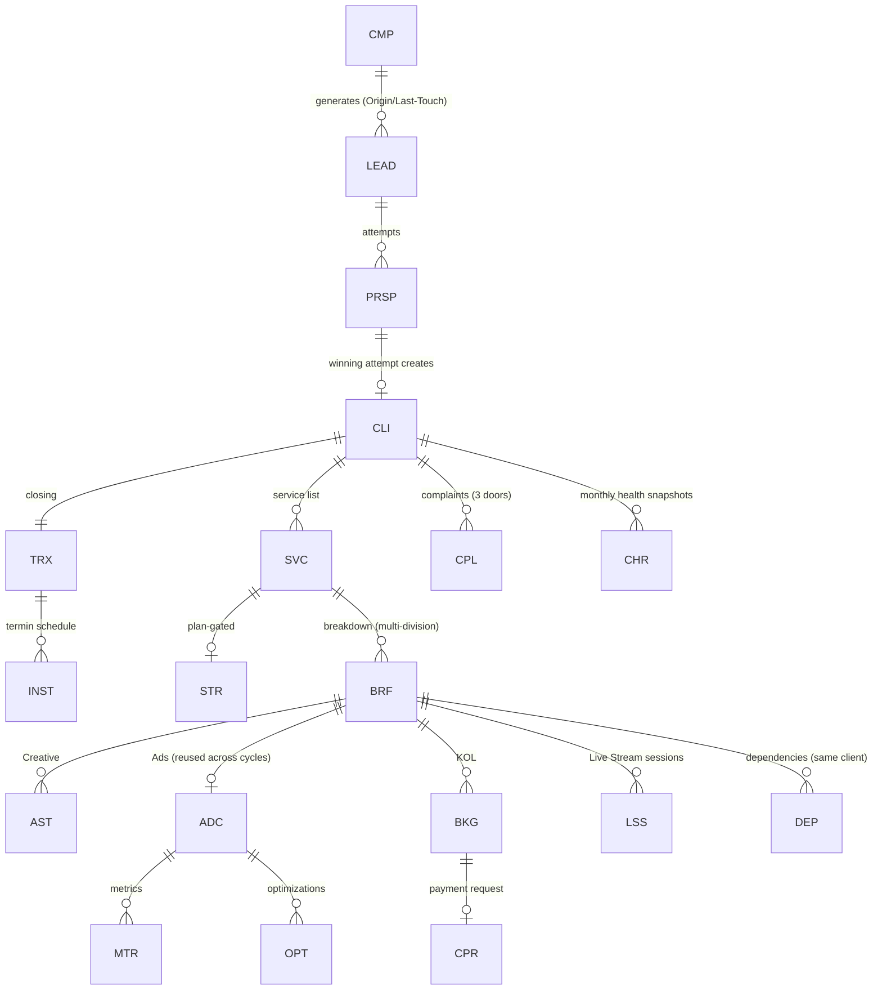

# CDPS — Data Model Reference (consolidated from Phase 0 §3.1 as-built registry + Modules 0–15)

> Source of truth remains the PRD files. This is a navigation/implementation aid: every entity, its prefix, parent, owner module, and creation trigger. If anything here conflicts with a PRD file, the PRD wins — flag it in `docs/DECISIONS.md`.

## 1. Entity registry (as-built)

| Entity | Prefix | Parent | Owner module | Created when |
|---|---|---|---|---|
| Lead record (central registry) | `LEAD-` | — | M1 | First valid intake (Marketing import or Sales registration) |
| Prospect attempt | `PRSP-` | LEAD | M0/M1 | Sales registration or Pool claim; multiple attempts per LEAD allowed for Pool leads |
| Prospect activity (log effort) | `ACT-` | PRSP | M0/M1 | Sales mencatat aktivitas (Follow Up / Jadwal Meeting / Online Meeting / Visit / Lainnya) pada prospek ber-status `Qualified` s.d. state negosiasi terakhir. Banyak per PRSP; append-only (trigger menolak UPDATE/DELETE); ringkasan hasil wajib. **Deviasi PRD** — keputusan pemilik 2026-08-06, lihat `DECISIONS.md` |
| Lead delete request | `LDR-` | LEAD | M1 | Sales mengajukan hapus (alasan wajib); ACC Head memindahkan lead ke `[Deleted]`. **Deviasi PRD** — keputusan pemilik 2026-07-29, lihat `DECISIONS.md`. Satu pending per LEAD (`uq_ldr_one_pending`) |
| Campaign (acquisition) | `CMP-` | — | M3 | Marketing creates; 1:1 with Marketing Performance Record (M2) |
| Marketing Performance Record | (lives on CMP) | CMP 1:1 | M2 | With campaign; holds budget + auto metrics |
| Client | `CLI-` | — | M0→M4 | At `Closed-Success` (winning attempt) |
| Transaction | `TRX-` | CLI | M0→M5 | At closing |
| Installment | `INST-` | TRX | M5 | Termin scheme: schedule set at intent time |
| Transaction change request | `TCR-` | TRX | M5 | SPV/Head Finance mengajukan perubahan skema/jadwal (alasan wajib); **ACC Direktur** yang menerapkannya. **Revisi aturan M5-OA-6 → M5-OA-7** — keputusan pemilik 2026-08-04, lihat `DECISIONS.md`. Satu pending per TRX (`uq_tcr_one_pending`); jadwal pengganti Σ = Amount Outstanding, termin terverifikasi tidak disentuh |
| Service | `SVC-`* | CLI | M0→M6 | At closing, one per service line; upsell = new Service; errors via Void Service (M4-OA-5) |
| Strategy & Plan | `STR-` | SVC | M6 | Plan-gated services, before Brief creation |
| Plan-gate determination | (lives on SVC, PK `service_id`) | SVC 1:1 | M6C | Tier katalog `ditentukan_am`: AM menjawab form G-B sebelum Brief pertama. Menyimpan pemicu yang menyala + keputusan + arah override (`sesuai`/`tolak_plan`/`tambah_plan`) |
| Contract (kesepakatan klien) | `CTR-` | CLI | M6A/M6B | **O57, keputusan pemilik 2026-08-07.** Satu kesepakatan yang memayungi n Service milik SATU klien — klien yang membeli Store Management + GMV Max + Nano KOL dalam satu kesepakatan 12 bulan mendapat SATU Strategi, bukan tiga. Memegang **jendela kontrak** (`durasi_bulan`, `tanggal_mulai`, `tanggal_akhir`) sebagai satu-satunya sumber: kolom senama di `strategi` DIHAPUS migrasi 20260807120000, supaya generator periode M6B (§7 "n periode = n bulan kontrak") tidak punya dua angka untuk dipilih. `services.contract_id` nullable — Service tanpa kesepakatan payung tetap sah. Konsistensi klien dijaga FK KOMPOSIT `(contract_id, client_id)` ke `contracts (id, client_id)`, bukan trigger. **Tanpa mesin status**: tidak ada PRD yang memberi kontrak siklus hidup, dan mendaftarkan mesin kosong berarti mengarang nama state (aturan rumah #2). Uang TIDAK di sini — nilai sepakat & termin tetap `TRX`/`INST` |
| Strategi (Full Store Management) | `STRG-` | CTR | M6A | Dibuat AM untuk Service plan-gated. **Satu versi = satu BARIS** (Rule 13): `versi_no` + `strategi_induk_id` + `versi_sebelumnya_id`; index parsial `uq_strategi_aktif_per_contract` menjamin satu `Aktif` **per KONTRAK** (O57). Anak: `strategi_channel` → `strategi_baseline_bulan` (baris per `(channel, month_index)`, D11), `strategi_target`, `strategi_assumption`, `strategi_pillar`, `strategi_resource`, `strategi_risk`, `strategi_version` (append-only), `strategi_akses` (A-15 matriks channel × akses × status; A-16 blocker = flag `memblokir` + `target_tanggal_beres` pada baris yang SAMA, bukan tabel kedua). **Section A (A-05) adalah 20 kolom di `strategi` sendiri** — diisi sekali per Strategi, bukan per channel (§4); **Section B grup B-2…B-9 (A-06) adalah kolom di `strategi_channel`** (satu angka per channel; yang per bulan tetap baris di `strategi_baseline_bulan`). Kolom Section A/B NULLable dan kelengkapannya ditegakkan gerbang submit, karena §7 meminta autosave 20 detik dan §5 langkah 5 meminta hitungan hidup field yang belum terisi. **Section C (A-07) = empat tabel anak** (`strategi_diagnosa`, `strategi_quick_win`, `strategi_risiko_struktural`, `strategi_prasyarat_klien`) — semuanya daftar berulang. **Section D (A-08) menambah NOL tabel:** D-1/D-2/D-4 sudah di `strategi_target` dan D-8/D-9 di `strategi_assumption` sejak A-03; yang baru adalah tiga kolom `definisi_berhasil_30/60/90` (D-5 — kardinalitasnya TETAP tiga, jadi kolom, bukan tabel anak), satu array jsonb `leading_indicator` (D-6 — `ck_strategi_leading_indicator` menegakkan bentuk array + cap 5 + keanggotaan set tertutup lewat `<@`, set-nya = kosakata metrik D-4; pertanyaan terbuka X-13), dan lima kolom `sanggahan_*` (D-7 — **HARD-INTERNAL §4.1**, advisory, dan tidak bisa menurunkan floor karena jalur tulisnya tidak menyentuh `strategi_target`). **D-3 TIDAK punya kolom sama sekali** — turunan dari D-2 (X-11). `strategi_assumption.status` di-flip lewat endpoint tersendiri yang sengaja bisa dijangkau saat `Aktif` (asumsi gugur saat eksekusi), dan flip ke `Gugur` mengemisikan `strategi_revisi_disarankan`. **Section E/H narasi (A-09a) = empat kolom header** (`growth_thesis` E-1 · `urutan_eksekusi_alasan` E-13 · `skenario_mundur` H-3 · `kondisi_stop_scope` H-4 — H-4 **HARD-INTERNAL §4.1**). **Section E/G/H/I sisanya (A-09b) = lima tabel anak + enam kolom:** `strategi_ketergantungan_klien` (E-12 — item/kapan/konsekuensi; **sengaja BUKAN digabung dengan C-7 `strategi_prasyarat_klien`**: C-7 gerbang sebelum eksekusi dan tak punya konsekuensi, E-12 ketergantungan berjalan yang seluruh gunanya ada di `konsekuensi`), `strategi_fase` (G-1, min 2), `strategi_tanggal_besar` (G-2 — dibaca M6B Rule 7 untuk re-weight distribusi mingguan), `strategi_trigger_revisi` (H-2 — tujuh kode ditranskripsi dari §4, `ambang` wajib untuk `pencapaian_di_bawah_target`/`stok_kosong` dan wajib NULL untuk sisanya; `uq_strtrg_kode` parsial supaya `lainnya` boleh berulang), dan `strategi_dispatch` (**I-2 + I-4 satu tabel** — keduanya ber-key divisi, jadi catatan I-4 adalah kolom di baris penerima Brief, bukan tabel kedua; set divisi identik `briefs.assigned_division`). Kolom: `review_klien_frekuensi`/`_format`/`_pic` (G-3) + `review_internal_frekuensi` (G-4) — **teks bebas karena §4 menandai G-3/G-4 `Struct`, bukan Enum**, dan PRD tidak pernah menulis daftar frekuensi; `metrik_laporan_klien` jsonb (I-3, set tertutup = kosakata D-4, pertanyaan terbuka **X-14**); dan `prioritas`/`prioritas_alasan` di **`strategi_channel`** (E-2 — di baris channel, bukan tabel anak, karena `saveChannels` DELETE-then-INSERT). **H-2 juga menutup J-3:** `strategi_version.trigger_revisi` menerima string apa pun sejak A-03 karena daftar Rule 13 belum ada; `ck_strver_trigger_set` sekarang mengikatnya ke set H-2 yang sama, dan subset per-Strategi (J-3 ⊆ H-2 record ini) ditegakkan domain karena CHECK tidak boleh ber-subquery. **I-1 dan J-4 TIDAK punya kolom** — turunan, sekelas D-3/X-11. Diikat ke `CTR`, bukan `SVC` (O57 SELESAI 2026-08-07): jalur Service → Strategi tetap satu hop lewat `services.contract_id`, dan `GET/POST /services/{id}/strategi` tidak berubah. `strategi_target.sumber_floor` mencatat **jalur persetujuan** (`input_am` → `disetujui_head`), bukan asal angka |
| Plan period | `PLAN-` | CTR (full-mgmt) atau CLI (Plan Satuan) | M6B | **Bentuk dibangun B-01** (`20260810000000_m6b_plan.sql`): tabel `plan` + enam anak (`plan_target` PK (plan,channel,metric) dengan `nilai_strategi` immutable · `plan_row` unit kerja P-C, ber-FK ke `strategi_pillar`/`services`, satu asal ditegakkan `ck_plan_row_asal_tunggal` · `plan_row_week` P-D · `plan_actual` hybrid P-E, `sumber` manual/otomatis · `plan_review` 1:1 P-F · `plan_flag` P-G auto). **Satu baris = satu PERIODE** (§8); n periode = durasi kontrak. `lingkup ∈ kontrak/klien` menyatukan Full-Management (ber-`contract_id`+`strategi_id`) dan Plan Satuan (`klien`, keduanya NULL), dipasangkan `ck_plan_lingkup_shape`. Mesin **#16** (`Terjadwal`→`Draft`→`Diajukan`→`Aktif`→`Ditutup`; auto 2..n via `Terjadwal`→`Aktif`). GENERASI periode (B-02), gerbang transisi (B-03), penyesuaian target (B-04), distribusi mingguan (B-05), realisasi hybrid (B-06 — `20260810020000`) SUDAH mendarat. **B-06:** metrik `otomatis` di `plan_actual` UPDATE-blocked untuk aktor JWT (AM) di **DB + RLS** (invariant beku): trigger `trg_plan_actual_no_manual_auto` (belt, semua koneksi; aktor sistem = tanpa klaim JWT → lolos; hanya `sengketa` boleh berubah di baris otomatis) + RLS `WITH CHECK` (`plan_actual_insert` manual-only, `plan_actual_update` scope via `private.jwt_can_write_plan`). GMV manual lewat `recordManualActual`; auto lewat `recordAutoActual` (sistem). Pasca-tutup TIDAK dikunci (X-07) → amandemen di `audit_log`, nol kolom baru. **Tutup transaksional (B-07) & carry-over eksplisit (B-08 — `20260810030000`) SUDAH mendarat.** **B-08:** kolom `plan_row.keputusan_carryover` (`dibawa`/`dibatalkan`/`revisi`, NULL=belum diputus; disposisi baris ASAL, beda dari `terbawa` yang menandai baris TUJUAN); `decideCarryOver` mencap keputusan + `audit_log` immutable, `dibawa` menyalin baris ke periode berikutnya (`terbawa`+`periode_asal_id`, `kuota` apa adanya — tak ada hitung "sisa"). Komponen `defisit_terbawa` §263 "Σ negative variance chosen to carry" DITUNDA (X-18); deficit tetap = Σ penyesuaian turun (B-04, dihitung). Job (B-09) SUDAH mendarat. **Plan Satuan (B-10 — `20260811000000_m6b_plan_satuan.sql`) SUDAH mendarat:** lihat baris `Plan Satuan (rantai)` di bawah. Periode anniversary-month |
| Plan Satuan (rantai) | — (PK `client_id`) | CLI | M6C §7 | **B-10** — tabel rantai `plan_satuan` (satu per klien, S2): `tanggal_mulai_siklus` (jangkar Rule 7 — untuk Full-Mgmt ada di `strategi`, Plan Satuan tak punya Strategi) + `status_dormansi` (mesin **#17** `Aktif ⇄ Dorman`, STATE_MACHINES §6e). BUKAN kolom di `plan`: dormansi properti RANTAI, bukan satu periode (n salinan = anti-pola). Periode-nya tetap baris `plan` `lingkup='klien'` (mesin #16). Rule 6 (buka/gabung/reaktivasi) = `openOrJoinPlanSatuanTx` dipanggil di `plangate.decideGate` saat `keputusan_am='butuh_plan'`, mengisi `service_plan_gate.plan_id` (FK-nya juga B-10). `plan_flag` jenis `di_luar_service` (analog `di_luar_strategi`, §7.9). Review tutup 4-field (bukan 8) untuk `lingkup='klien'` — tanpa diagnosa/rekomendasi (tak ada Strategi). Nol prefix baru (kunci rantai = client_id). **B-11 (integritas §4b, `20260811010000`):** trigger `trg_spg_service_single_plan` di `service_plan_gate` — saat `plan_id` diisi, Plan yang ditaut wajib `lingkup='klien'` DAN service yang kontraknya punya Strategi (kontrak Full-Management) ditolak masuk Plan Satuan (sudah tercakup Plan `lingkup='kontrak'`); "satu service ⇒ ≤1 Plan" sendiri dipikul PK `service_plan_gate(service_id)`, jadi tak ada index redundan. Cerminan TS beku: `plangate.serviceInFullMgmtContract` + `MSG_FULL_MGMT_PLAN`. Penanda full-mgmt = Strategi pada kontrak, ber-scope KONTRAK bukan KLIEN |
| Vendor | `VND-` | — | M6A | Master record bersama (bukan milik satu klien). Prasyarat E-8/F-4 — live stream adalah mode VENDOR (D15/Rule 18), jadi pilar `live` menunjuk `vendors` lewat FK dan tidak menarik kapasitas divisi internal. Tulis: lead Account/Direksi; baca: semua karyawan (E-8 picker). Status lewat mesin `vendor` |
| Brief | `BRF-` | SVC | M6 | AM breaks a Service down; one Service → many Briefs across divisions |
| Interview (Kualifikasi Klien) | `ITV-` | CLI (opsional CTR/SVC) | M6-Interview | AM membuka "Kelola Klien" — SATU sesi Kelola Klien = satu ITV. Bentuk ID rumah `ITV-YYYYMM-NNNN` (BUKAN `ITV-YYYY-NNNNN` dari PRD), preseden STRG/PLAN/VND. Klik ulang **melanjutkan** sesi non-terminal yang sama (`openKelolaKlien`), bukan membuat baris baru |
| Riset Awal (langkah 1 Kelola Klien) | — (PK `interview_id`) | ITV 1:1 | M6-Interview | **QA pemilik 2026-08-12.** Lahir bersama ITV di transaksi yang sama: membuka Kelola Klien = mulai riset awal (AM login toko klien & catat data baseline). Mesin **#20** `riset_awal` (`Berjalan → Selesai`, STATE_MACHINES §6f). **Nol prefix baru** — kunci alami `interview_id`, preseden `plan_satuan`. Jangkar `dimulai_pada`/`disubmit_pada` dibekukan trigger; **durasi TIDAK disimpan**, diturunkan saat baca oleh `durasiRisetAwalMenit` (aturan rumah #4). Kolom isian (sebagian pindahan dari daftar pertanyaan Interview) = bagian 2, belum dibangun |
| Asset (Creative unit of work) | `AST-` | BRF | M7 | Brief breakdown into per-deliverable rows |
| Ad Campaign (client-facing paid media) | `ADC-` | BRF (setup) | M8 | Distinct from M3 `CMP-`; persists across recurring strategy cycles |
| Metric Entry | `MTR-` | ADC | M8 | Periodic (weekly confirmed) manual metric input |
| Optimization Log | `OPT-` | ADC | M8 | Each ongoing optimization action |
| Creator Booking (KOL unit of work) | `BKG-` | BRF | M9 | Per creator secured for a client campaign |
| Creator Payment Request | `CPR-` | BKG | M9→M5 | After QC pass; Finance executes disbursement |
| Live Stream Session | `LSS-` | BRF | M10 | AM requests a vendor session; one Brief → many Sessions |
| Dependency | `DEP-` | BRF↔BRF | M11 | AM/SPV declares cross-Brief dependency (same Client only) |
| Complaint | `CPL-` | CLI | M6 | Any of 3 doors (Sales / AM-WhatsApp / Client Portal) — one entity, `Source` field |
| Client Health Report Snapshot | `CHR-` | CLI | M13 | Monthly batch, immutable |
| Performance Score | `PERF-` | User | M14 | Monthly batch, immutable |
| Master Service List entry | (versioned config) | — | Phase 0 v2 §10 | Sales Head/SPV manages; deals reference the version at closing date |

**Prefix registry (M6A §7).** Sejak 2026-08-06 daftar prefix hidup di DUA tempat yang
dijaga tetap identik: tabel `entity_prefix` (PK ⇒ duplikat mustahil) dan `PREFIXES` di
`packages/core/src/ident.ts`. `packages/db/src/ident.registry.test.ts` memindai setiap
call site pembuat ID dan gagal kalau ada prefix yang tidak terdaftar. Tes itu menemukan
`ACT`/`LDR`/`DEMO` mencetak ID tanpa terdaftar — jangan menambah prefix tanpa
mendaftarkannya di kedua tempat.

*`SVC-` prefix: Service IDs are generated at closing per M0 §6; exact prefix string not spelled in the PRDs — confirm prefix label at ticketing (registry pattern implies `SVC-YYYYMM-NNNN`). Log in DECISIONS.md once fixed.

**"Task" is NOT an entity.** It's a role played by AST / BKG / BRF-as-task (Ads). Module 12 adds computed fields (`turnaround_time`, `revision_turnaround`, `speed_score`, `revision_count`) onto those rows, derived from transition history — never stored as independently mutable values.

## 2. Relationship spine (mermaid)

## 3. Key cross-module fields (frequent bug sources — read carefully)

| Field | Lives on | Rule |
|---|---|---|
| Origin Campaign | LEAD → CLI | Immutable first-touch; client lineage (M3 rollups). Written by **both** intake doors: Marketing import, and Sales single registration via the campaign picker (`GET /marketing/campaigns/selectable` — EVERY status, since a campaign absent from the picker can never be attributed and so reads as a permanent zero). **Mandatory when Source ∈ {Leads - Iklan, Broadcast, Event, Kulwa}** (M1 §9.3) unless the salesperson declares the lead outside any campaign — that declaration lives in the audit log (`outside_campaign`), never as a placeholder id. Registration never changes a campaign's status (unlike the import door). See DECISIONS 2026-08-04 |
| Last-Touch Campaign | LEAD | Non-destructive separate field; marketing-spend credit (M2 Attributed Sales). May legitimately diverge from Origin — by design, not a bug |
| GMV saat ini (baseline) | CLI | 3-month avg, frozen at closing; OD-only exceptional correction |
| Total Sales (current) | CLI | Auto + AM manual entries at lower confidence tier; MEA-managed channels only |
| Sales PIC | CLI | = Primary Salesperson (M0 OD-1) |
| Commission & Payment PIC | CLI | From Closing Form; reminder target (M0 OD-3); reassignable by Sales Lead |
| Sales Allocation | CLI | Read-only snapshot, Σ=100% |
| Data Confidence Tier | LSS GMV, manual Total Sales entries | `Vendor-Reported` vs `Platform-Verified`; full value either way, visible badge |
| SLA Target | per Task (AST/BKG/BRF-as-task) | Set individually at breakdown by Lead/SPV; missing ⇒ Speed Score = N/A, never backfilled |
| Component Weights Used | CHR, PERF | Stored per snapshot (post-redistribution) — weights vary month to month |

## 3a. Master Service List v2 Schema (2026-07-16)

Sumber seed kanonik: `backend/seed/msl_kalkulator.csv` (32 layanan dari sheet "Kalkulator Service Jasa"), validasi di `docs/handoff/MSL_KALKULATOR_VALIDASI.md`. Lihat DECISIONS 2026-07-16 untuk konteks keputusan.

**Master Service Version Fields (tambahan):**

| Field | Type | Rule |
|---|---|---|
| category | string | Kategori layanan (opsional, untuk grouping di admin) |
| unit | string | Satuan harga (mis. "per produk", "per 1K view", "per session (3 jam)", "Paket") |
| min_qty | decimal | Batas minimal kuantitas untuk pricing_mode tertentu |
| pricing_mode | enum | `flat` (qty×harga), `min_floor` (max(qty,min)×harga), `batch_ceiling` (ceil(qty/min)×min×harga), `passthrough` (nominal diinput langsung) |
| apply_ppn | bool | PPN 11% ditambahkan (round half-up) bila true |
| frequency | enum | `Monthly`, `One-time`, `Campaign` |
| price_note | string | Catatan tambahan (mis. komisi khusus, syarat khusus) |
| description | string | Deskripsi layanan |

**Qualified Form Services Fields (tambahan):**

| Field | Type | Rule |
|---|---|---|
| quantity | decimal | Jumlah unit yang dipilih (required untuk pricing calculation) |
| input_amount | decimal | Nominal langsung (hanya jika `pricing_mode=passthrough`; null untuk mode lain) |
| unit | string | Satuan (copy dari MSL version, untuk audit) |
| min_qty | decimal | Batas minimal (copy dari MSL version, untuk audit) |
| pricing_mode | enum | Mode penetapan harga (copy dari MSL version) |
| apply_ppn | bool | Flag PPN (copy dari MSL version) |
| subtotal | decimal | Nilai baris terhitung: `flat`=qty×harga; `min_floor`=max(qty,min)×harga; `batch_ceiling`=ceil(qty/min)×min×harga; `passthrough`=input_amount; +PPN 11% jika `apply_ppn`. **Pinned (immutable), recomputable dari parameter.** Estimasi Nilai M0 = Σ subtotal baris. |

## 4. Computation registry (all read-only, recompute-from-log)

- **M0:** Estimasi Nilai Transaksi, Perhitungan Komisi (from Master Service List version at date), allocation math.
- **M2:** CPL, CPRL, Lead-Quality Rate, ROAS (booked), Collected-ROAS (verified amounts, M5), junk breakdown.
- **M5:** Amount Verified/Outstanding, Transaction rollup (`[Lunas]` only when all INST `[Terverifikasi]`).
- **M12:** turnaround_time (excludes `[Blocked]` intervals; revision rounds do NOT reset), revision_turnaround, speed_score (uncapped), revision_count (≥3 auto-flags Quality review).
- **M13:** 7 sub-scores (capped 0–100), weight redistribution for missing components, Health Score + band; monthly snapshot immutable; live preview never stored.
- **M14:** role KPI Profiles (weights admin-configurable), raw components normalized `Actual÷Target×100` capped 100, Client-Outcome Modifier `clamp((avg−80)÷2, −10, +10)`, final bounded 0–100.
