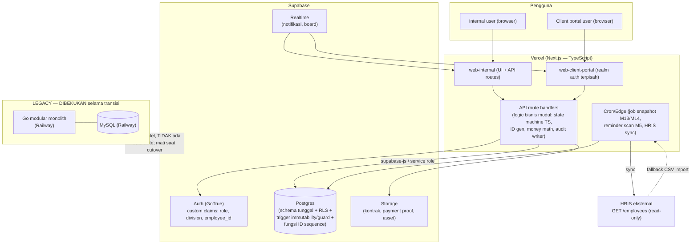

# PLAN UTAMA — Migrasi Backend CDPS: Go + MySQL (Railway) → Supabase (Postgres) + Vercel

**Tanggal:** 2026-07-22
**Status:** DRAF PERENCANAAN — butuh sign-off Yohan + Nerissa sebelum eksekusi
**Sifat:** Dokumen strategi. TIDAK berisi kode implementasi. Sistem existing (Go+MySQL) TIDAK diubah oleh dokumen ini.
**Dokumen pendukung:** `SUPABASE_MIGRATION_TECH_APPENDIX.md` (lampiran teknis A–G), `SUPABASE_MIGRATION_INVENTORY.md` (inventaris as-built).

---

## 1. Ringkasan Eksekutif

### Apa
Memigrasikan sistem CDPS (Client Delivery & Performance System) MEA Agency dari stack lama
**Go modular-monolith + MySQL di Railway** ke stack baru **TypeScript (Next.js API routes/route
handlers) di Vercel + Supabase (Postgres, Auth/GoTrue, Storage, Realtime, RLS)**.

CDPS mencakup siklus klien penuh: intake lead → closing sales → payment gate → eksekusi delivery
(Creative/Ads/KOL/Live-Stream) → client health scoring → team performance → portal. 16 modul
(`module0_sales` … `module15_portal`) di atas 7 core engine (`internal/core/`: audit, ident, money,
notification, permission, statemachine, tz). As-built saat ini: 26 pasang file migrasi (0001–0037, penomoran dengan gap; 49 tabel; ±195 registrasi route HTTP),
frontend `web-internal` (Next.js) sudah ada dan deploy di Railway; `web-client-portal` masih ditunda.

### Kenapa
Driver keputusan (hasil interview pemilik, final):
1. **Biaya & ops hosting** — konsolidasi ke Supabase + Vercel memangkas beban operasional dua-platform.
2. **Kecepatan develop FE** — `supabase-js` + typegen memangkas boilerplate data-access.
3. **Fitur bawaan Supabase** — Realtime (notifikasi & board live), Storage (kontrak/proof/asset),
   RLS (baseline permission di lapisan DB), Edge Functions (job terjadwal / webhook).
4. **Standarisasi tim ke TypeScript** — satu bahasa lintas FE + BE, mengurangi context-switch.

### Prinsip inti — "sistem lama tidak disentuh"
- **Go backend DIBEKUKAN (freeze) hari ini.** Tidak ada perubahan kode Go lagi. Ia tetap jalan di
  MySQL/Railway sebagai **sistem berjalan (system of record)** sampai cutover.
- Semua pekerjaan BARU langsung di stack Supabase/Vercel.
- Pendekatan **HYBRID / STRANGLER**: bangun ulang modul-per-modul di stack baru mengikuti build order
  lama, verifikasi paritas per modul, lalu **cutover big-bang sekali** (lihat §5) — bukan dual-write.
- **House rules CLAUDE.md WAJIB dipertahankan bit-for-bit** di stack baru (lihat §3): ID
  `PREFIX-YYYYMM-NNNN` pasca-validasi; state machine server-side + pesan Bahasa Indonesia `[...]`;
  audit log append-only immutable; derived field read-only & recomputable; role matrix Phase 0;
  format IDR `Rp. X.XXX.XXX,00`; notifikasi in-app dari audit log.
- **PRD tetap sumber kebenaran.** Migrasi bukan kesempatan mendesain ulang perilaku. Jika perilaku
  Go menyimpang dari PRD, PRD yang menang; jika ambigu → catat di `docs/DECISIONS.md`, jangan pilih diam-diam.

---

## 2. Arsitektur Target

### 2.1 Diagram komponen



### 2.2 Pembagian tanggung jawab (di mana logic hidup)
- **Logic bisnis inti** = Next.js API route handlers (TypeScript). State machine engine, ID generator,
  money math (komisi, alokasi Σ=100%, rollup termin, ROAS), audit writer, notification producer —
  semua di-port ke TS sebagai library bersama (mirror `internal/core/`).
- **Postgres triggers + constraints** = penjaga integritas yang TIDAK boleh bisa dilewati aplikasi:
  immutability audit/history (BEFORE UPDATE/DELETE → RAISE), CHECK constraint status enum, fungsi
  ID-sequence per prefix+bulan. Ini **safety net di DB**, bukan tempat seluruh logic.
- **RLS** = baseline permission (row visibility per role/division). Otorisasi kaya (lock matrix,
  layered OD/Director, visibility pra-rilis) tetap ditegakkan di API layer juga — RLS adalah
  lapisan pertahanan tambahan, bukan satu-satunya.
- **Prinsip:** BUKAN "semua logic di database". DB memberi jaminan yang tak bisa dilanggar; API
  memberi perilaku & pesan BI yang persis sesuai PRD.

### 2.3 Layout monorepo (final per keputusan OQ-7, 2026-07-22: API TERPISAH)
```
AgencyAPP/
  backend/            # Go — DIBEKUKAN, read-only, dipensiun saat cutover (arsip, OQ-8)
  web-internal/       # Next.js internal — UI saja; nanti repoint ke apps/api
  web-client-portal/  # Next.js portal — realm auth terpisah (Wave 3, ditunda O4/O5)
  apps/
    api/              # BARU — Next.js API-only app (route handlers per modul
                      #   module0 … module15), deploy Vercel terpisah
  packages/           # BARU — kode bersama apps/api + kedua web app
    core/             #   port TS core engines: statemachine, ident, money,
                      #     audit, notification, permission, tz, importer
    db/               #   klien Postgres (postgres.js/drizzle) + generated types
  supabase/
    migrations/       # SQL Postgres (port 37 file lama + migrasi native baru)
    functions/        # Edge Functions (cron: snapshot, reminder)
    seed.sql          # fixture Alpha Digital (paritas dgn seed Go)
  docs/               # SUMBER KEBENARAN — tetap; tambah DECISIONS entri migrasi
```
Detail lengkap (koneksi pooler, env vars, preview deployment + Supabase branching) di
Lampiran Teknis §E. **OQ-7 RESOLVED 2026-07-22: pemilik memilih app API TERPISAH** (`apps/api`)
— bukan menumpang `web-internal`; pemisahan tegas UI vs API.

---

## 3. Pemetaan House Rules → Mekanisme Stack Baru

| # | Aturan lama (CLAUDE.md) | Implementasi Go sekarang | Implementasi di Supabase/TS |
|---|---|---|---|
| 1 | **ID `PREFIX-YYYYMM-NNNN` pasca-validasi, immutable, tak dipakai ulang** | `internal/core/ident`, tabel `id_sequences` | Fungsi Postgres `next_id(prefix, yyyymm)` + tabel `id_sequences` (row-lock per prefix+bulan, `NNNN` reset per bulan). Dipanggil dari API **hanya setelah** validasi mandatory-field lolos. ID kolom `NOT NULL` + `UNIQUE`, tanpa jalur update. Registry prefix = `docs/DATA_MODEL.md`. |
| 2 | **State machine server-side, transisi ilegal diblokir + pesan BI `[...]`** | `internal/core/statemachine` + tabel transisi per entity | Engine transisi TS (config deklaratif diekspor dari `docs/STATE_MACHINES.md`) menegakkan transisi + kembalikan string BI persis. Penegakan ganda di DB: kolom status `CHECK (status IN (...))` + trigger `BEFORE UPDATE` menolak transisi yang tak ada di tabel `state_transitions`. **Tidak ada** raw update ke kolom status di mana pun. |
| 3 | **Audit log append-only, immutable; tak ada UPDATE/DELETE** | `internal/core/audit` | Tabel `audit_log` (actor, action, before, after, ts). Trigger `BEFORE UPDATE OR DELETE ON audit_log` → `RAISE EXCEPTION`. GRANT hanya INSERT/SELECT ke role aplikasi; REVOKE UPDATE/DELETE. Semua metrik durasi diturunkan dari ts di sini. |
| 4 | **Derived field read-only & recomputable dari log** | recompute event-driven + snapshot cron | Kolom derived (ROAS, CPL, speed score, health, komisi, turnaround, rollup) TIDAK pernah di-set user. Dihitung di API layer / generated column / fungsi SQL, selalu bisa dibangun ulang dari event+timestamp log. Test recompute-from-log wajib. Snapshot bulanan (M13/M14) via Edge Function cron. |
| 5 | **Pesan validasi Bahasa Indonesia dalam `[...]`, string persis PRD** | konstanta string per handler | Konstanta string TS bersama (satu sumber), mirror verbatim string yang sudah dipin di `docs/DECISIONS.md` (mis. `[total alokasi sales harus 100%]`, `[maksimal 5 salesperson per closing!]`, `[field ini terkunci, tidak bisa diubah]`, default `[data tidak lengkap, silahkan lengkapi semua pertanyaan wajib!]`). JANGAN rename label BI. |
| 6 | **Role matrix Phase 0: staff=own, lead/SPV=division, OD=read-only+OKR, Director=full; OD/Director layered** | `internal/core/permission` | Custom claims di Supabase Auth JWT (`role`, `division`, `employee_id`, flag layered `is_od`/`is_director`). RLS policy per tabel pakai claims (`auth.jwt()`). Otorisasi kaya (lock matrix M4, visibility pra-rilis M5, layered roles) ditegakkan juga di API. Setiap endpoint punya test permission per role. |
| 7 | **Format IDR `Rp. X.XXX.XXX,00`; div-by-zero render `—`** | helper `money` | Helper format TS bersama. Simpan uang sebagai `NUMERIC`/`BIGINT` sen-atau-rupiah-utuh (ikuti kanon Go: desimal kanonik di audit, tampilan `Rp. X.XXX.XXX,00`). Pembulatan komisi = round-half-up ke rupiah utuh (DECISIONS 2026-07-09 W1-06). Div-by-zero di metrik → `—`, bukan error. |
| 8 | **Notifikasi in-app v1, diturunkan dari audit log, katalog Phase 0 v2 §9; tak terhapus, hanya read/unread** | `internal/core/notification` (katalog FROZEN — 15 event terdaftar per as-built `notification.go`) | Tabel `notifications` diisi oleh producer di API (event catalog dipertahankan verbatim, termasuk `m1.lead.co_pursuit`/`EvLeadCoPursuit` dan `EvHoursLoggedReminder`). Push ke klien via **Supabase Realtime**. Hanya kolom `read_at` yang mutable; tak ada DELETE. Resolver audiens (`explicitOrLeads`, dual-audience OD-3) diport apa adanya. |

**Catatan kritis paritas:** semua string BI dan keputusan engineering yang sudah tercatat di
`docs/DECISIONS.md` (O1, O14–O19, W1-06/09/14/15/17/18/19, QC Jalur B, M1 dedup v2 kolaboratif)
adalah **kontrak** — port TS harus mereproduksinya, bukan menafsir ulang.

---

## 4. Fase-Fase Migrasi (dengan exit criteria per fase)

> Estimasi relatif S/M/L (bukan tanggal). Urutan modul mengikuti build order lama (DECISIONS 2026-07-09).

### Fase 0 — Fondasi stack baru (setup + core engines) — **L**
**Scope:** Setup project Supabase (dev/staging/prod), konversi skema MySQL→Postgres, port 7 core
engine ke TS, CI/CD Vercel, harness test.
**Deliverables:**
- Project Supabase baru — **DIBUAT 2026-07-22: `CDPS SG`** (ref `egddxfcnrtecheiykhlf`), region
  **`ap-southeast-1` Singapore per arahan pemilik** (menyimpang dari pola org lama yang di Sydney
  `ap-southeast-2` — MSDPS/MCN MEA), Postgres 17. Catatan operasional: project `CDPS` pertama
  (ref `klrmguatvzbmujihzacl`, Sydney, salah region) harus DIHAPUS manual dari dashboard oleh
  pemilik (API tidak menyediakan delete; pause ditolak untuk paid tier). Project staging menyusul.
  Vercel project terhubung repo.
- Konversi skema: 26 migrasi MySQL (0001–0037) → migrasi Postgres di `supabase/migrations/`
  (AUTO_INCREMENT→IDENTITY, `DATETIME(6)`→`timestamptz`, `TINYINT(1)`→boolean, JSON→jsonb; catatan:
  skema as-built TIDAK memakai ENUM — detail per konstruksi di Lampiran Teknis §A).
- Fungsi `next_id()` + tabel `id_sequences`; trigger immutability `audit_log`; trigger guard status.
- Port TS: `statemachine`, `ident`, `money`, `audit`, `notification`, `permission`, `tz` + unit test
  (transisi ilegal, immutability, permission denial, ID-after-validation) — mirror test Go.
- Fixture seed Alpha Digital di Postgres; pipeline CI (lint, typecheck, test DB-backed) hijau.
**Exit criteria:** Dummy entity mendemonstrasikan transisi diblokir + pesan BI + audit trail penuh
di Postgres; `next_id` menghasilkan format `PREFIX-YYYYMM-NNNN` benar & reset per bulan; trigger
menolak UPDATE/DELETE `audit_log`; seluruh unit-test core hijau; seed jalan end-to-end.

### Fase 1 — Auth + HRIS sync + Master Service List — **M**
**Scope:** Supabase Auth (GoTrue), employee sync + role-mapping, Master Service List admin (Phase 0 §10).
**Deliverables:**
- Migrasi auth lokal → Supabase Auth; custom claims (role/division/employee_id, layered OD/Director);
  kredensial existing di-import langsung (hash bcrypt → GoTrue, keputusan OQ-3) + smoke-test login.
- Sumber data karyawan = **import CSV/spreadsheet admin-triggered** (keputusan OQ-4 2026-07-22:
  endpoint HRIS tidak dipakai lagi) → tabel `employees` + `role_mappings` (jabatan/divisi → role
  CDPS); deaktivasi karyawan diberlakukan saat re-import/aksi admin → ban user di GoTrue.
- MSL admin (versioned, dikelola Head of Sales; `effective_from`; deal kunci versi pada tanggal closing).
- RLS policy baseline diaktifkan pada tabel employees/MSL.
**Exit criteria:** Login via Supabase Auth berhasil; role ter-map dari HRIS; deaktivasi karyawan
memutus akses pada sync berikutnya; MSL terbaca oleh kalkulator komisi; RLS baseline lolos test.

### Fase 2 — Wave 1: Money path (M0, M1, M4, M5) — **L**
**Scope:** Lead → close → payment gate. Modul paling kritis (kebenaran uang + state machine).
**Deliverables:**
- **M0 Sales:** registrasi/dedup, Qualified form, auto Estimasi Nilai & Komisi dari MSL, negosiasi +
  approval + versioning, closing (alokasi ≤5, Σ=100%, Commission & Payment PIC), generate CLI/TRX/SVC.
- **M1 Leads:** registry LEAD, bulk import, dedup v2 **kolaboratif** (co-pursuit, event ke-14),
  Pool vs Scouted, klaim kompetitif, bad-lead evaluation.
- **M4 Client Record v2:** provenance inheritance, lock matrix server-side, Void Service + cascade,
  payment-intent handoff, field OD-1.
- **M5 Admin & Finance:** TRX + jadwal `INST-`, 4 skema, verifikasi (event-log `payment_verifications`
  immutable), routing gate (pembayaran pertama rilis ke Account), reminder dual-audience, flag kontrak 7-hari.
- Importer (dry-run SAVEPOINT + Apply atomik per baris) diport; replay pembayaran lewat jalur `Verify` resmi.
**Exit criteria (UAT Sales + Finance):** satu deal jalan end-to-end di stack baru — registered →
qualified → negotiated (approval superior riil) → closed → ID ter-generate → jadwal Termin dibuat →
Finance verifikasi → klien routing ke antrean Account; komisi dicek independen vs MSL; **semua string
BI dan transisi ilegal identik dengan Go**; fixture Alpha Digital lolos.

### Fase 3 — Wave 2: Delivery engine (M6, M12, M7, M8, M9, M10) — **L**
**Scope:** Mesin eksekusi delivery. M12 dibangun awal (M7/M8/M9 plug ke engine-nya).
**Deliverables:**
- **M6 Account & Service:** assignment AM, Strategy & Plan gate, Service→Brief fan-out, Brief Kanban,
  complaint door (3 sumber), revision routing.
- **M12 Task Execution:** canonical task machine, turnaround/speed/revision compute, `[Blocked]`
  SPV-only, block-request queue.
- **M7 Creative** (asset fan-out, revision loop, Daily Output), **M8 Ads** (ADC/MTR/OPT, launch
  guardrail, attribution feedback), **M9 KOL** (booking lifecycle, QC, CPR→Finance), **M10 Live
  Stream** (vendor tracker, rekonsiliasi, GMV confidence tier).
- Realtime board (Kanban) + Storage untuk asset.
**Exit criteria:** klien gaya Alpha Digital jalan satu siklus delivery penuh: Service → Brief ≥2
divisi → Task dengan Speed Score live → satu revision loop → satu interval `[Blocked]` dikecualikan
dari turnaround → sesi live-stream terrekonsiliasi. Paritas string/transisi vs Go.

### Fase 4 — Wave 3: Attribution, visibility, scoring + Portal (M2, M3, M11, M13, M14, M15) — **L**
**Scope:** Layer read/aggregate, batch scoring, portal. Client Portal terakhir (setelah security spec).
**Deliverables:**
- **M2 Marketing + M3 Campaign:** performance record, CPL/CPRL/ROAS/Collected-ROAS, campaign
  lifecycle, atribusi last-touch vs origin.
- **M11 Unified Board:** universal-column mapping, Dependency (circular check), My Tasks.
- **M13 Client Health** & **M14 Team Performance:** snapshot bulanan (Edge cron), weight
  redistribution, band-drop flag, KPI profile per role, Client-Outcome Modifier.
- **M15 Portals:** Team Portal + **Client Portal** di `web-client-portal` — **realm auth terpisah**,
  data layer allow-list ketat (RLS + policy khusus), mengikuti `docs/M15C2_CLIENT_PORTAL_SECURITY_SPEC.md`.
**Exit criteria:** management buka satu dashboard, lihat Health band semua klien; staff lihat skor
bulanan + breakdown; satu klien pilot login Portal **tanpa** bisa mengakses data klien lain (audit
RLS lolos, penetration check dasar lolos).

### Fase 5 — Cutover data & pensiun Go/Railway — **M**
**Scope:** Pindah data riil final, cutover produksi, matikan Go/MySQL/Railway.
**Deliverables:**
- Keputusan data (lihat §5 & Asumsi): jika masih UAT/seed → re-run importer/seed di Postgres; jika
  ada data riil → ETL satu-kali (pgloader/skrip) + rekonsiliasi hitung baris & checksum kunci.
- Cutover big-bang: freeze tulis Go, migrasi data final, verifikasi paritas, alihkan DNS/domain ke Vercel.
- Runbook rollback (kembali ke Go/MySQL bila verifikasi gagal dalam window).
- Dekomisioning Go/MySQL/Railway setelah periode observasi stabil.
**Exit criteria:** semua modul live di Supabase/Vercel; hitung baris & spot-check derived match antara
sumber lama & baru; tidak ada jalur tulis ke MySQL; Railway dimatikan; runbook rollback terbukti kering.

---

## 5. Strategi Koeksistensi & Cutover

### Model koeksistensi
- **Go frozen di MySQL = system of record** sepanjang transisi. Pengguna tetap memakai sistem lama
  untuk operasi harian sampai cutover.
- **TIDAK ada dual-write.** Menulis ke dua DB berbeda (MySQL + Postgres) dengan dua implementasi
  logic berbeda akan menciptakan drift yang mustahil dijaga konsisten — terutama pada derived field
  (komisi, health, speed score) dan audit immutability. Dual-write juga menggandakan permukaan bug
  dan menghapus manfaat "sistem lama tidak disentuh".
- Stack baru dibangun & diuji **di lingkungan terpisah** (Supabase dev/staging) dengan fixture +
  salinan data untuk UAT paritas per fase. Tidak menyentuh MySQL produksi.

### Rekomendasi cutover: **BIG-BANG sekali, saat exit criteria Fase 2 (money path) tercapai** untuk
data, dengan **peralihan pengguna dilakukan setelah paritas cukup**.
Dua tafsir cutover — pilih sesuai kesiapan bisnis (→ OQ):
- **Opsi A (direkomendasikan bila data masih UAT/seed):** karena data dianggap belum riil, cutover =
  bangun semua fase di stack baru, lalu **satu peralihan** begitu paritas end-to-end (minimal Wave 1
  money path, idealnya Wave 2) lolos UAT. Data cukup di-seed/import ulang. Risiko data hilang ~nol.
- **Opsi B (bila sudah ada data riil):** freeze tulis Go sepanjang maintenance window → ETL satu-kali
  MySQL→Postgres → verifikasi → alihkan pengguna. Tetap big-bang (bukan bertahap per gelombang data).

**Kenapa big-bang, bukan cutover bertahap per gelombang data:** entitas CDPS sangat terkait
(LEAD→PRSP→CLI→TRX→INST→SVC→BRF→AST/BKG/…). Memindah sebagian entitas sementara sisanya di MySQL
memaksa cross-DB foreign key & sinkronisasi dua arah = kompleksitas + drift yang justru ingin
dihindari. Big-bang menjaga integritas referensial dalam satu DB dan menghormati prinsip "sistem lama
tidak disentuh" (Go tetap utuh sampai dimatikan sekaligus).

**Guard:** cutover hanya boleh setelah (a) fixture Alpha Digital lolos end-to-end di stack baru, (b)
paritas string BI + transisi ilegal terverifikasi, (c) runbook rollback ke Go/MySQL terbukti kering.

---

## 6. Risiko & Mitigasi

| # | Risiko | Dampak | Mitigasi |
|---|---|---|---|
| R1 | **Paritas logic hilang** (komisi round-half-up, alokasi Σ=100%, state machine, ROAS, dedup v2) saat port Go→TS | Uang salah / transisi salah / regresi diam-diam | Test-first untuk state machine & money math; port test Go sebagai golden-file; jalankan Go & TS berdampingan atas fixture yang sama, bandingkan output byte-for-byte sebelum cutover. |
| R2 | **Drift dari PRD** saat menulis ulang | Perilaku menyimpang dari spec | PRD tetap sumber kebenaran; larang "desain ulang" saat migrasi; setiap deviasi → entri `docs/DECISIONS.md`; reuse string BI yang sudah dipin. |
| R3 | **RLS misconfig di Client Portal** (kebocoran data lintas-klien) | Pelanggaran keamanan serius | Portal realm auth terpisah; RLS deny-by-default + policy allow-list eksplisit; ikuti `M15C2_CLIENT_PORTAL_SECURITY_SPEC.md`; audit RLS + penetration check dasar jadi exit criteria Fase 4; jangan pernah pakai internal view yang di-trim permission. |
| R4 | **Vendor lock-in Supabase** | Sulit pindah kelak | Simpan logic bisnis di API TS (portabel), bukan seluruhnya di Postgres proprietary; pakai fitur SQL standar; Storage/Realtime di balik interface tipis; migrasi = Postgres standar (bisa self-host Supabase/Postgres murni). |
| R5 | **Cold start Vercel** pada endpoint jarang dipakai / cron | Latensi UAT & job telat | Konsolidasi route; pertimbangkan fluid/edge runtime untuk endpoint kritis; job berat (snapshot M13/M14) via Edge Function terjadwal, bukan on-request; monitor p95. |
| R6 | **Perbedaan dialek SQL MySQL→Postgres** (AUTO_INCREMENT, `DATETIME(6)`, ENUM, backtick, `NOW(6)`, semantik lock) | Bug halus (mis. presisi mikrodetik `bermasalah_flagged_at` DECISIONS W1-18) | Konversi skema eksplisit di Fase 0; petakan tiap tipe; `timestamptz` + presisi jelas; uji ulang kasus race yang sudah terdokumen; jangan andalkan konversi otomatis buta. |
| R7 | **Tim belum familiar RLS / Postgres** | Policy salah, produktivitas turun awal | Pelatihan RLS di Fase 0–1; pola policy reusable + review wajib; RLS sebagai lapisan tambahan (API tetap menegakkan otorisasi) sehingga bug RLS tidak jadi satu-satunya pertahanan. |
| R8 | **Migrasi auth** (auth lokal Go → Supabase Auth/GoTrue) | Pengguna tak bisa login / hash password tak kompatibel | Rencana migrasi kredensial (import hash bila kompatibel, atau forced reset terkontrol via HRIS sync + admin reset); uji login semua role di staging; Client Portal realm terpisah diuji sendiri. |
| R9 | **Ketergantungan HRIS** (endpoint `GET /employees` masih ditunda tim HRIS) | Sync karyawan/role-mapping tertahan | Pertahankan fallback CSV di balik interface sync (sudah ada preseden Sprint 0 / DECISIONS 2026-07-10); tidak hardcode data karyawan; swap ke endpoint riil tanpa ubah konsumen. |
| R10 | **Scope creep lintas 16 modul** saat rewrite | Timeline melar | Gate fase ketat (tak mulai Fase N+1 sebelum exit N lolos), mirror wave gate Build Plan §4; perubahan keputusan PRD hanya via Nerissa + decision log. |
| R11 | **Immutability tidak setegang di MySQL** | History bisa termutasi | Trigger `BEFORE UPDATE/DELETE → RAISE` + REVOKE privilege di Postgres; test immutability wajib per modul (Definition of Done). |

---

## 7. Asumsi & Open Questions — ✅ DIKONFIRMASI PEMILIK 2026-07-22 (lihat DECISIONS ronde 2)

**Asumsi — SEMUA DIKONFIRMASI:**
- **A1 — Status data: CONFIRM** — data masih **UAT/seed**; migrasi data = re-run importer/seed di
  Postgres. Jalur cadangan pgloader tetap terdokumentasi (Lampiran §F.2) tapi tidak diperlukan.
- **A2 — Distribusi logic: CONFIRM** — logic bisnis inti di Next.js API routes (TS) + Postgres
  trigger/constraint untuk immutability & guard; RLS = baseline permission.
- **A3 — Urutan migrasi modul: OK** — mengikuti build order lama.

**Open Questions — jawaban pemilik (2026-07-22):**
- **OQ-1 — RESOLVED:** PIC keputusan gate migrasi = **Yohan & Nerissa** (berdua).
- **OQ-2 — RESOLVED:** data masih **UAT** → cutover Opsi A (§5): re-seed/import ulang, risiko data ~nol.
- **OQ-3 — RESOLVED:** **import langsung** hash bcrypt ke GoTrue (bukan forced reset). Catatan
  engineering: jalur ini menyentuh `auth.users` langsung via SQL (di luar admin API standar) —
  wajib smoke-test login semua role di staging sebelum dinyatakan selesai (Lampiran §C.2 poin 1 & 4).
- **OQ-4 — RESOLVED:** endpoint HRIS `GET /employees` **TIDAK dipakai lagi** di stack baru. Sumber
  data karyawan = **import CSV/spreadsheet** (jalur fallback yang sudah ada preseden menjadi jalur
  utama, admin-triggered). Deaktivasi karyawan diberlakukan saat re-import/aksi admin, bukan sync
  endpoint. `docs/HRIS_API_CONTRACT.md` tidak diimplementasikan di stack baru.
- **OQ-5 — MASIH OPEN (pemilik minta penjelasan; tidak blocking):** pertanyaannya: aplikasi
  reporting eksternal `mea-client-reporting` yang sudah ada — apakah dashboard-nya bisa ditanam
  (embed/iframe) di dalam Client Portal M15 nanti, atau portal harus membangun tampilan reporting
  sendiri. Karena Client Portal DITUNDA (O4/O5), jawaban baru dibutuhkan bila portal dihidupkan.
- **OQ-6 — RESOLVED:** tidak ada target biaya khusus Supabase/Vercel.
- **OQ-7 — RESOLVED:** app API **TERPISAH** (`apps/api`), bukan menumpang `web-internal` (§2.3).
- **OQ-8 — RESOLVED:** Go+MySQL **boleh disimpan sebagai arsip read-only** pasca-cutover (tidak
  wajib dihapus permanen).

---

## 8. Definition of Done Migrasi — per Modul

Sebuah modul dinyatakan **selesai dimigrasikan** hanya jika SEMUA berikut lolos (paritas dengan Go +
kepatuhan house rules CLAUDE.md):

1. **Paritas state machine:** test transisi ilegal untuk setiap entitas modul → diblokir server-side
   dengan **string BI `[...]` PERSIS** sama dengan Go/PRD (bukan parafrase). Transisi legal sesuai
   `docs/STATE_MACHINES.md`.
2. **Permission per role:** test per role per endpoint (staff/lead-SPV/OD/Director + **layered
   OD/Director**), termasuk visibility pra-rilis (M5 §5) & lock matrix (M4 §4) di mana relevan. RLS +
   otorisasi API dua-duanya diuji.
3. **Immutability:** test membuktikan tidak ada jalur UPDATE/DELETE pada baris history/audit (trigger
   RAISE + privilege REVOKE terverifikasi).
4. **Recompute derived field:** setiap field auto-calculated (komisi, ROAS, CPL, speed score, health,
   turnaround, rollup termin) dibangun ulang dari event/timestamp log dan cocok dengan nilai tersimpan;
   div-by-zero → `—`; format IDR `Rp. X.XXX.XXX,00`.
5. **ID generation:** ID `PREFIX-YYYYMM-NNNN` hanya lahir setelah validasi mandatory-field lolos;
   immutable; unik; reset `NNNN` per bulan.
6. **Notifikasi:** event katalog Phase 0 v2 §9 (15 event terdaftar as-built, termasuk
   `m1.lead.co_pursuit` dan `EvHoursLoggedReminder`) teremit di titik yang benar; hanya read/unread,
   tak terhapus; terkirim via Realtime.
7. **Fixture Alpha Digital lolos end-to-end** di stack baru sebagai test otomatis (worked example
   Phase 0 OA-14).
8. **Paritas berdampingan:** untuk modul money path (M0/M4/M5) & scoring (M13/M14), output TS dicek
   byte-for-byte vs Go atas fixture yang sama sebelum modul ditandai selesai.
9. **Keputusan tercatat:** setiap deviasi dari perilaku Go/PRD yang ditemukan saat migrasi → entri
   `docs/DECISIONS.md` (tanggal, keputusan, alasan, disetujui). Tidak memilih interpretasi diam-diam.

---

*Akhir draf PLAN UTAMA. Dokumen ini perencanaan — implementasi menyusul per fase setelah sign-off.*
